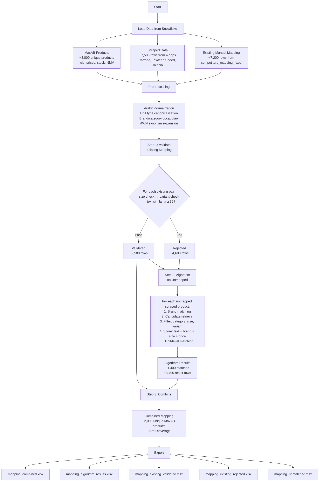
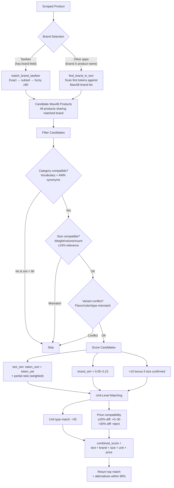

# SKU Mapping Pipeline

## Purpose

Automatically maps MaxAB product SKUs to competitor/scraped product listings from four external sources (Cartona, Tawfeer, Speed, Talabia). This mapping feeds the Market Data Module with competitor price references used across the entire pricing system. The pipeline validates existing manual mappings, runs a fuzzy-matching algorithm on unmapped products, and combines both into a unified mapping table.

---

## Pipeline Flow

---

## Matching Algorithm Detail

---

## Arabic NLP Processing

The pipeline includes a custom Arabic NLP layer for handling product name matching:

| Component | Description |
|-----------|-------------|
| **Diacritics removal** | Strips all Arabic diacritical marks (tashkeel) |
| **Alef normalization** | Unifies alef variants (أ, إ, آ, ٱ) → ا |
| **Taa marbuta / Alef maqsura** | ة → ه, ى → ي for consistent matching |
| **Eastern digits** | ٠-٩ converted to 0-9 |
| **Measurement normalization** | جرام/غرام/g → جم, كيلو/kg → كجم, ملل/ml → مل, etc. |
| **Size extraction** | Parses `(\d+)\s*(unit)` patterns; normalizes to base units (g, ml, mm) |
| **Count extraction** | Detects quantity × unit patterns (e.g., "12 قطعة", "6 رول") |
| **AWN synonyms** | Arabic WordNet expansion for category vocabulary matching |
| **Al-prefix stripping** | Optional removal of ال prefix for token comparison |

---

## Key Functions

| Function | Description |
|----------|-------------|
| `normalize_arabic` | Full Arabic text normalization pipeline |
| `extract_size_info` / `extract_count_info` | Parse weight/volume/count from product names |
| `sizes_compatible` | Compare two products' sizes with ±15% tolerance |
| `variant_conflict` | Detect flavor/color/type mismatches (e.g., "strawberry" vs "mango") |
| `category_compatible` | Check if scraped product fits MaxAB category (vocabulary + AWN) |
| `descriptive_overlap` | Verify shared descriptive tokens beyond brand/noise words |
| `text_sim` | Max of token_sort_ratio, token_set_ratio × 0.95, partial_ratio × 0.85 |
| `find_brand_in_text` | Detect MaxAB brand names within scraped product text |
| `match_brand_tawfeer` | Brand matching for Tawfeer (has separate brand field) |
| `price_compat` | Multi-strategy price comparison (direct, per-unit, same-qty, blind) |
| `validate_existing_match` | Validate a manual mapping pair against size/variant/text filters |
| `get_candidates` | Retrieve and score candidate MaxAB products for a scraped item |
| `match_units` | Match at packing-unit level with unit type and price scoring |
| `map_one` | Full matching pipeline for a single scraped product |

---

## Inputs / Outputs

### Inputs

| Source | Query File | Description |
|--------|-----------|-------------|
| MaxAB products | `current_sku_data.sql` | Active products with stock or NMV (cohort 700 prices, stocks, 120d sales) |
| Scraped data | `raw_scraped_data_latest.sql` | Last 4 days of competitor prices from `raw_scraped_data` |
| Existing mapping | `existing_mapping_query.sql` | Manual mapping from `competitors_mapping_fixed` |

### Outputs

| File | Contents |
|------|----------|
| `mapping_combined.xlsx` | All validated + algorithm matches (primary output) |
| `mapping_algorithm_results.xlsx` | Algorithm matches only, with scores and price comparison |
| `mapping_existing_validated.xlsx` | Existing manual mappings that passed validation |
| `mapping_existing_rejected.xlsx` | Existing manual mappings that failed validation (with reasons) |
| `mapping_unmatched.xlsx` | Scraped products with no match found |

---

## Matching Thresholds

| Parameter | Value | Description |
|-----------|-------|-------------|
| `SOFT_THRESHOLD` | 90 | Text similarity below this requires additional checks (category, descriptive overlap) |
| `min_ts` (in `map_one`) | 45 | Minimum text similarity to consider a candidate |
| `PRICE_HARD_MAX` | 0.30 (30%) | Maximum price difference allowed |
| Price compatible | ≤ 0.20 (20%) | Price difference considered "compatible" |
| Size tolerance | 0.15 (15%) | Allowed size/count deviation |
| Existing mapping text sim | ≥ 35 | Looser threshold for human-validated pairs |
| Brand fuzzy match | ≥ 90 | Minimum score for fuzzy brand matching |
| Category token fuzzy | ≥ 75 | Minimum score for category vocabulary token matching |
| Variant words | ~130 terms | Flavors, colors, types, subtypes that trigger conflict detection |

---

## Competitor Sources

| Source | Has Brand Field | Has Quantity | Notes |
|--------|----------------|--------------|-------|
| **Cartona** | No (in product name) | No | Brand detected from product text; blind price comparison |
| **Tawfeer** | Yes | Yes | Separate brand field enables direct matching |
| **Speed** | No (in product name) | No | Brand detected from product text; blind price comparison |
| **Talabia** | No (in product name) | Yes | Brand detected from product text |

---

## Dependencies

| Dependency | Role |
|------------|------|
| `setup_environment_2` | Snowflake credentials and environment initialization |
| `rapidfuzz` | Fuzzy string matching (token_sort_ratio, token_set_ratio, partial_ratio) |
| `wn` (Arabic WordNet) | Synonym expansion for category vocabulary (`omw-arb:1.4`) |
| `snowflake-connector-python` | Database queries |
| `openpyxl` | Excel export |
| SQL files in `Mapping/` | `current_sku_data.sql`, `raw_scraped_data_latest.sql`, `existing_mapping_query.sql` |
