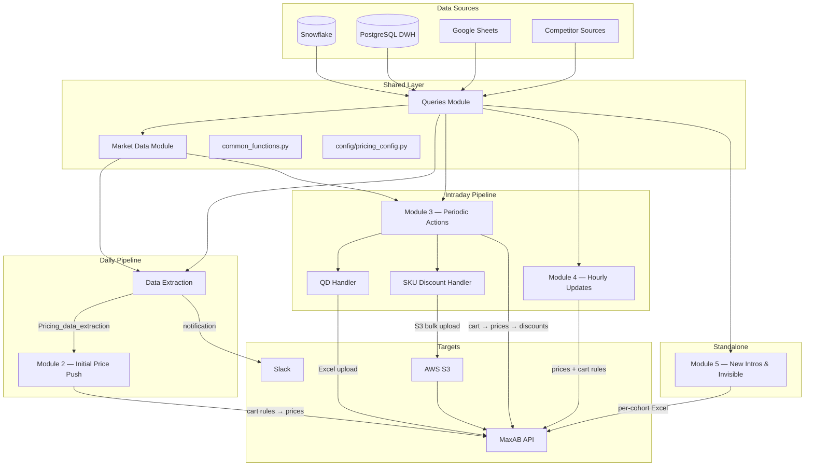
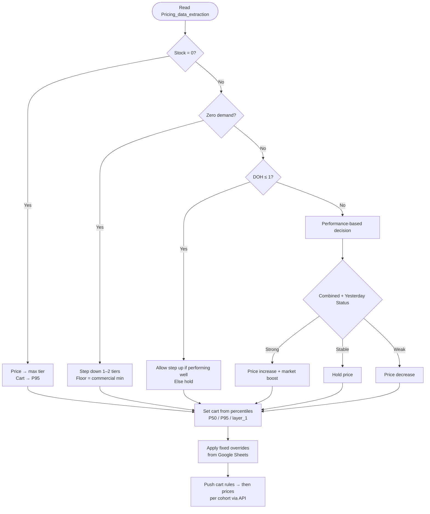
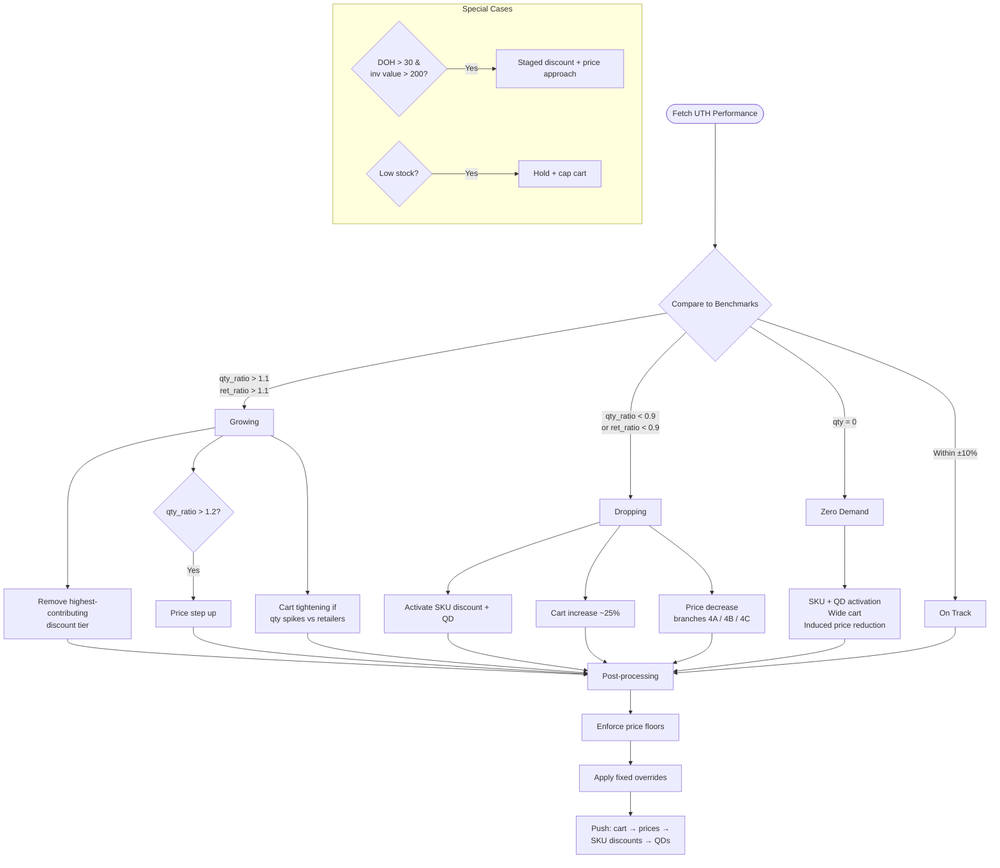
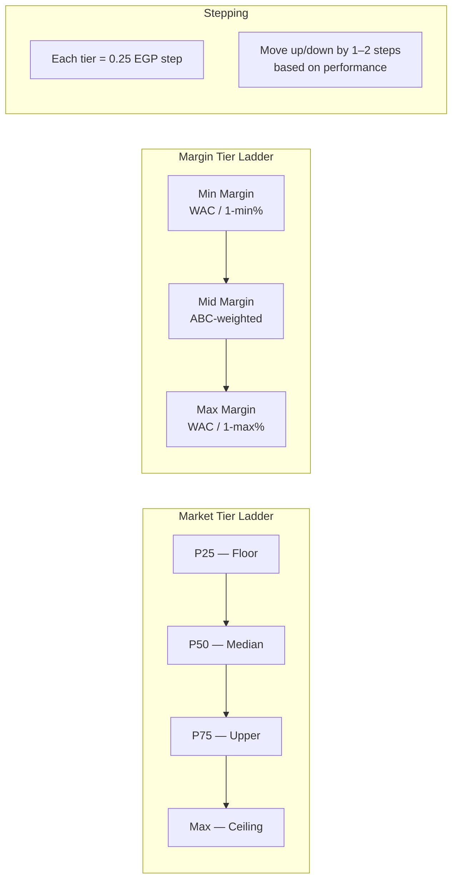
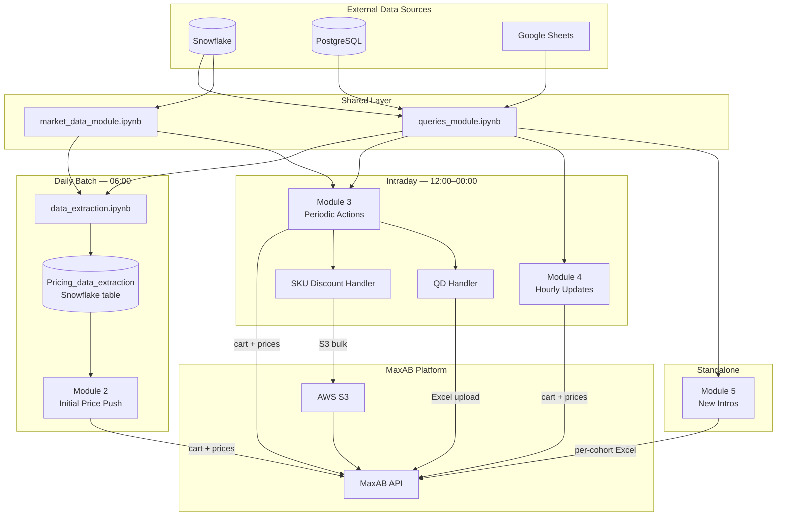

# MaxAB Pricing Automation System

Automated SKU-level pricing engine for **MaxAB Egypt** — managing prices, cart rules, SKU discounts, and quantity discounts across 12 warehouses and 8 cohorts. The system runs on a daily + intraday cycle, pulling data from Snowflake, PostgreSQL, Google Sheets, and competitor sources, then pushing changes to the MaxAB API.

---

## Module Overview

| Module | File | Schedule (Cairo) | Purpose |
|--------|------|-------------------|---------|
| Market Data | `market_data_module.ipynb` | Daily, pre-pipeline | Collects competitor/market prices; builds margin tiers and brand fallbacks |
| Data Extraction | `data_extraction.ipynb` | Daily, ~5:30 AM | Builds wide warehouse-SKU dataset from 20+ Snowflake queries |
| Module 2 — Initial Price Push | `module_2_initial_price_push.ipynb` | Daily, 6:00 AM | Baseline price & cart rule reset using performance + market tiers |
| Module 3 — Periodic Actions | `module_3_periodic_actions.ipynb` | 12 PM, 3 PM, 6 PM, 9 PM, 12 AM | UTH-based intraday price/discount/cart adjustments |
| Module 4 — Hourly Updates | `module_4_hourly_updates.ipynb` | 1-2 PM, 4-5 PM, 7-8 PM, 10-11 PM, 12 AM, 3 AM | WAC-driven and growth-based hourly price tweaks |
| Module 5 — New Intros & Invisible | `module_5_new_intros_invisible.ipynb` | Scheduled standalone | First-time pricing for new and invisible SKUs |
| QD Handler | `qd_handler.ipynb` | Called by Module 3 | Quantity discount lifecycle (deactivate → create 3-tier QDs) |
| SKU Discount Handler | `sku_discount_handler.ipynb` | Called by Module 3 | Per-SKU special discount lifecycle via S3 bulk upload |
| Queries Module | `queries_module.ipynb` | Shared library | Centralized data access layer (Snowflake, PostgreSQL, Sheets) |

---

## Architecture



---

## Daily Pipeline Flow


---

## Module Details

### 1. Market Data Module

**File:** `modules/market_data_module.ipynb`

Collects competitor and market prices from three sources — **Ben Soliman**, **Marketplace**, and **Scraped** — all via Snowflake. Builds market price percentiles (P25, P50, P75, max) per SKU, constructs margin tier ladders, and computes brand-level fallbacks where SKU-level data is missing. Outputs market signals (uptrend / downtrend / stable) used by all downstream modules.

### 2. Data Extraction

**File:** `data_extraction.ipynb`

Builds a comprehensive warehouse × SKU dataset by joining 20+ Snowflake queries: product base, WAC costs, market data, 120-day NMV sales, margin stats/targets, inventory, demand signals, PO/leadtime, active discounts, cart rules, and ABC classification. Computes derived fields like `price_position`, `performance_tag`, `DOH`, `running_rate`, and `ABC_class`. Exports to Excel, writes to Snowflake table `Pricing_data_extraction`, and sends a Slack notification on completion.

### 3. Module 2 — Initial Price Push

**File:** `modules/module_2_initial_price_push.ipynb` | **Schedule:** Daily 6:00 AM Cairo

Performs the baseline price and cart rule reset each morning. Reads from `Pricing_data_extraction` and walks a decision tree per warehouse-SKU:



Target prices are computed from market/margin tier ladders in discrete steps (minimum 0.25 EGP). Fixed price and cart overrides from Google Sheets are applied last. Push order is always **cart rules first, then prices**.

### 4. Module 3 — Periodic Actions

**File:** `modules/module_3_periodic_actions.ipynb` | **Schedule:** 12 PM, 3 PM, 6 PM, 9 PM, 12 AM

The main intraday engine. Compares up-till-hour (UTH) quantity and retailer counts against dynamic benchmarks (P80 qty × quarterly contribution × hour contribution for quantity; P70 for retailers). Classifies each SKU as **Growing**, **On Track**, or **Dropping**.



**Daily caps:** max 3 price reductions per SKU; shared increase cap with Module 4.

**Post-processing:** price floor enforcement, fixed overrides, then push sequence: cart rules → prices → SKU discounts → QDs.

### 5. Module 4 — Hourly Updates

**File:** `modules/module_4_hourly_updates.ipynb` | **Schedule:** Off-Module-3 hours

Runs between Module 3 windows for fine-grained adjustments. Uses ±1 standard deviation bands for status classification.

| Trigger | Action |
|---------|--------|
| WAC increase > 0.5% (today's purchases) | Restore margin — price step up |
| UTH + last-hour both growing | Smooth price step up |
| Retailer-only growth | Conservative step up |
| Qty-only growth | Step up with caution |
| Commercial min violation | Enforce floor |
| Qty > 2× target | Cart rule tightening |

**Coordination rules:** 2-hour cooldown after Module 3, 1-hour self-cooldown, max 7 qty-driven price steps per day.

### 6. Module 5 — New Intros & Invisible

**File:** `modules/module_5_new_intros_invisible.ipynb` | **Schedule:** Standalone

Handles SKUs that need first-time pricing: **new intros** (stock present, no cohort price or invisible packing units). Price is calculated as:

```
price = WAC × basic_unit_count / (1 - margin)   →   rounded to nearest 0.25 EGP
```

Margin is resolved via hierarchy: brand + category target → category target → default 10%. Pushes per-cohort Excel files to the MaxAB API.

### 7. QD Handler

**File:** `modules/qd_handler.ipynb` | **Called by:** Module 3

Manages the full quantity discount lifecycle — deactivates all active QDs via API, then creates new ones.

| Tier | Source | Elasticity Ratio | Discount Cap |
|------|--------|-------------------|--------------|
| T1 | Market/margin ladder | 1.1 | 4% |
| T2 | Market/margin ladder | 3.0 | 5% |
| T3 | Wholesale (car-cost savings) | — | 6% |

Top 400 tier entries per warehouse by inventory value. QDs are uploaded via Excel to the MaxAB API. Cart rules are aligned to match the max tier quantity. Duration: **14 hours** from creation.

### 8. SKU Discount Handler

**File:** `modules/sku_discount_handler.ipynb` | **Called by:** Module 3

Per-SKU "Special Discounts" lifecycle: deactivate existing → create new ones via S3 bulk upload. Discount range: **0.25–5%** of effective price.

| Condition | Behavior |
|-----------|----------|
| Zero demand | Aggressive discounting |
| Overstock (DOH > 30) | Moderate discount push |
| Low stock | Protected — minimal/no discount |
| Normal (UTH-based) | On track / dropping / growing logic |

**Retailer targeting:** churned/dropped, category-not-product buyers, view-no-orders, out-of-cycle. Wholesale and inactive retailers are excluded. Duration: **14 hours**. Upload limits: 100 retailers per chunk, 1000 rows per file.

### 9. Queries Module

**File:** `modules/queries_module.ipynb`

Shared data access layer used by every module. Centralizes all external queries:

- **Snowflake:** stocks, prices, WAC, cart rules, packing units, UTH performance, hourly distribution, stock snapshots, percentiles, quarterly contribution, target turnover
- **PostgreSQL (DWH):** last-hour performance
- **Google Sheets:** fixed prices and cart rules (manual overrides)
- **Retailer selection:** churned buyers, category buyers, out-of-cycle, view-no-orders, exclusion lists

---

## Key Concepts

### Cohorts & Warehouses

MaxAB organizes Egypt into regional cohorts, each mapped to one or more physical warehouses. Pricing and cart rules are set **per cohort per SKU**.

| Region | Cohort ID | Warehouses |
|--------|-----------|------------|
| Cairo | 700 | Mostorod |
| Giza | 701 | Barageel, Sakkarah |
| Alexandria | 702 | Khorshed Alex |
| Delta West | 703 | El-Mahala, Tanta |
| Delta East | 704 | Mansoura FC, Sharqya |
| Upper Egypt — Menya | 1123 | Menya Samalot |
| Upper Egypt — Assiut | 1124 | Assiut FC |
| Upper Egypt — Sohag | 1125 | Sohag |
| Upper Egypt — Beni Suef | 1126 | Bani Sweif |

### WAC (Weighted Average Cost)

The cost basis for all margin calculations. WAC reflects the blended purchase cost across recent POs and is updated intraday when new purchases arrive. Module 4 specifically watches for WAC jumps > 0.5% to restore margin.

### Market & Margin Tier Ladders

Prices are not set as continuous values — they follow **discrete tier ladders** in 0.25 EGP steps. When market data exists, tiers are built from competitor price percentiles (P25, P50, P75, max). When no market data is available, tiers are derived from margin boundaries (min → max margin, split by ABC class).



### UTH (Up-Till-Hour) Performance

Cumulative sales metrics (quantity sold, unique retailers) from midnight to the current hour, compared against dynamic benchmarks. Benchmarks combine historical P80 quantity × quarterly seasonality × hourly distribution patterns. This drives all Module 3 and Module 4 decisions.

### Performance Statuses

Used by Module 2 for the daily baseline. Based on 120-day NMV achievement vs target:

| Status | Meaning |
|--------|---------|
| Star Performer | Consistently exceeds target |
| Over Achiever | Above target |
| On Track | Within ±10% of target |
| Underperforming | Below target |
| Struggling | Significantly below target |
| Critical | Deep underperformance |

### ABC Classification

SKUs are classified by order count contribution (descending):

| Class | Cumulative Share | Pricing Stance |
|-------|-----------------|----------------|
| A | ≤ 30% | Aggressive (lower market percentile, tighter margins) |
| B | ≤ 75% | Balanced |
| C | Remainder | Conservative (higher margins, wider cart rules) |

### DOH (Days on Hand)

```
DOH = current_stock / running_rate
```

Running rate is derived from recent sales velocity. DOH drives stock-aware decisions: low DOH (≤ 1) triggers protective holds; high DOH (> 30 with significant inventory value) triggers staged discounting.

### Price Position

Describes where the current SKU price sits relative to market data:

**Below Market → At Min → Below Median → At Median → Above Median → At Max → Above Market**

Used by modules to determine headroom for increases or urgency for decreases.

### Cart Rules

Minimum purchase quantity per SKU per cohort. Controls the smallest order a retailer can place. Cart rules are always pushed **before** prices to avoid transient states where a low cart and high price coexist. Typical sources: historical percentiles (P50, P95), normal refill + std deviation bands.

### Push Sequence

All modules follow the same push order to the MaxAB API:

1. **Cart rules** (set minimum purchase quantities)
2. **Prices** (set per-cohort SKU prices)
3. **SKU discounts** (Module 3 only)
4. **Quantity discounts** (Module 3 only)

This order ensures cart rules are in place before any price change takes effect.

---

## Tech Stack

| Component | Role |
|-----------|------|
| **Snowflake** | Primary data warehouse — market data, sales, inventory, benchmarks |
| **PostgreSQL** | DWH for last-hour performance data |
| **MaxAB API** | Target system — receives price, cart, and discount pushes |
| **Google Sheets** | Manual overrides for fixed prices and cart rules |
| **AWS S3** | Bulk upload channel for SKU discounts |
| **AWS Secrets Manager** | Credential storage for all external services |
| **Slack** | Pipeline notifications and alerts |
| **Python** | Runtime — Jupyter notebooks |
| Key libraries | `pandas`, `numpy`, `snowflake-connector-python`, `boto3`, `requests`, `openpyxl`, `gspread` |

---

## Data Flow



---

## Configuration

Central configuration lives in `config/pricing_config.py`. Key parameters:

| Parameter | Value | Description |
|-----------|-------|-------------|
| `MODULE_2_RUN_TIME` | 06:00 | Daily baseline push (Cairo) |
| `MODULE_3_RUN_TIMES` | 12, 15, 18, 21, 00 | Periodic action windows |
| `MIN_CART_RULE` | 2 | Absolute minimum cart (units) |
| `MAX_CART_RULE` | 150 | Cart ceiling |
| `MIN_PRICE_REDUCTION_PCT` | 0.25% | Smallest allowed price cut |
| `ON_TRACK_THRESHOLD` | ±10% | Band for "On Track" status |
| `P80_BENCHMARK_DAYS` | 240 | Lookback for qty benchmarks |
| `P70_RETAILER_DAYS` | 240 | Lookback for retailer benchmarks |
| `HOURLY_PATTERN_DAYS` | 120 | Lookback for hourly distributions |
| `TIMEZONE` | Africa/Cairo | All schedules in Cairo time |

ABC-class-specific settings:

| Setting | A | B | C |
|---------|---|---|---|
| Market percentile | P25 | P50 | P75 |
| Margin percentile | 50% | 75% | 90% |
| Cart std multiplier | 1× | 2× | 5× |

---

## Project Structure

```
Mustafa/
├── config/
│   └── pricing_config.py          # Central configuration
├── modules/
│   ├── market_data_module.ipynb    # Competitor/market data
│   ├── module_2_initial_price_push.ipynb
│   ├── module_3_periodic_actions.ipynb
│   ├── module_4_hourly_updates.ipynb
│   ├── module_5_new_intros_invisible.ipynb
│   ├── queries_module.ipynb        # Shared data access
│   ├── qd_handler.ipynb            # Quantity discounts
│   ├── sku_discount_handler.ipynb  # SKU special discounts
│   ├── push_prices_handler.ipynb   # API push helper
│   └── push_cart_rules_handler.ipynb
├── utils/
│   ├── pricing_helpers.py          # Shared pricing utilities
│   └── discount_api.py             # Discount API wrapper
├── queries/                        # Standalone SQL files
├── Mapping/                        # SKU mapping pipeline
├── data_extraction.ipynb           # Daily data build
├── scheduler.ipynb                 # Orchestrator
├── common_functions.py             # AWS secrets, env init
└── README.md
```

---

## Credentials & Secrets

All credentials are managed through **AWS Secrets Manager** (region: `us-east-1`). The `common_functions.py` module provides `get_secret()` and `initialize_env()` to load them into environment variables at runtime. No credentials are stored in code or config files.

Required secrets: Snowflake credentials, PostgreSQL DWH credentials, MaxAB API keys, Google Sheets service account, Slack webhook URL, S3 access keys.
