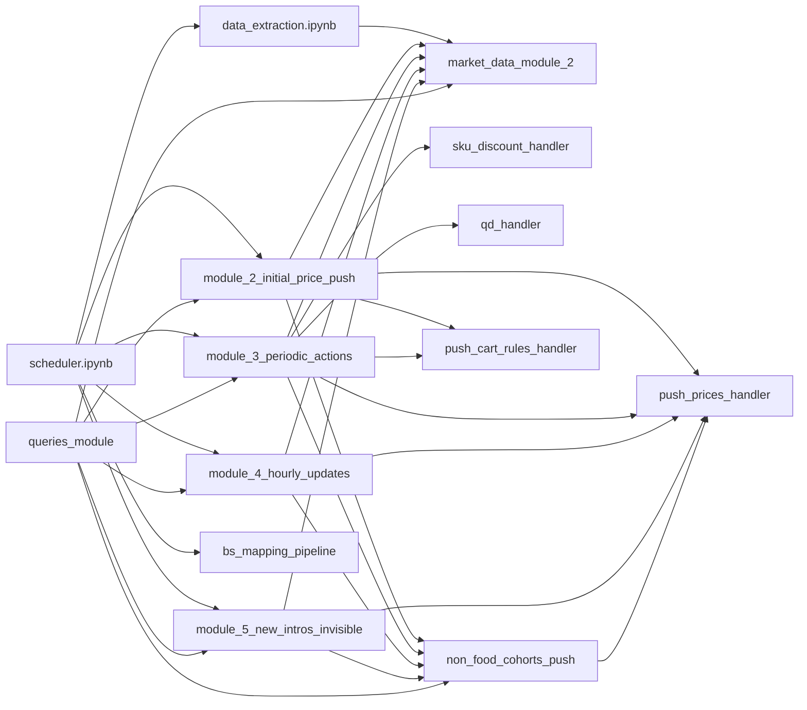

# MaxAB Pricing System — Documentation Index

This folder is the canonical reference for the entire MaxAB pricing automation system. Every notebook in `Mustafa/` and `Mustafa/modules/` has a corresponding `.md` here. Read **the script first**, then **its doc**, then come back here for cross-references.

## Quick map

## Daily flow (what happens when)

| Cairo time | Job | What it does |
|---|---|---|
| 04:30 | `bs_mapping_pipeline` | Refreshes Ben Soliman SKU mapping in `MATERIALIZED_VIEWS.bensoliman_inhouse_mapping` |
| 05:30 | `data_extraction` | Builds `MATERIALIZED_VIEWS.Pricing_data_extraction` (the input table for M2/M3/M4) |
| 06:30 | `module_2_initial_price_push` | Daily baseline price reset |
| 09:00 - 23:00 | `module_4_hourly_updates` | Hourly micro-adjustments (WAC / growth / commercial-min) |
| 12:00 / 17:00 / 23:00 | `module_3_periodic_actions` | Intraday UTH-driven price + discount + QD decisions |
| 09:30 | `module_5_new_intros_invisible` | First-time pricing for new SKUs / invisible SKUs / under-target-margin SKUs |

`scheduler.ipynb` orchestrates the whole thing via `jupyter nbconvert`. See [scheduler.md](scheduler.md).

## Documentation index

### Scheduler + entry points
- [scheduler.md](scheduler.md) — orchestrator + Slack alerting
- [data_extraction.md](data_extraction.md) — daily input table builder
- [bs_mapping_pipeline.md](bs_mapping_pipeline.md) — Ben Soliman SKU mapping

### Pricing modules
- [module_2_initial_price_push.md](module_2_initial_price_push.md) — daily baseline reset
- [module_3_periodic_actions.md](module_3_periodic_actions.md) — intraday UTH engine (3x/day)
- [module_4_hourly_updates.md](module_4_hourly_updates.md) — hourly micro-adjustments
- [module_5_new_intros_invisible.md](module_5_new_intros_invisible.md) — new intros + invisible + under-target-margin

### Shared / library
- [queries_module.md](queries_module.md) — central data-access layer
- [market_data_module.md](market_data_module.md) — legacy V1 market data (still used)
- [market_data_module_2.md](market_data_module_2.md) — V2 standalone market data pipeline
- [push_prices_handler.md](push_prices_handler.md) — MaxAB API price push helper
- [push_cart_rules_handler.md](push_cart_rules_handler.md) — MaxAB API cart rule push helper
- [sku_discount_handler.md](sku_discount_handler.md) — Special Discounts (called from M3)
- [qd_handler.md](qd_handler.md) — Quantity Discounts (called from M3)
- [non_food_cohorts_push.md](non_food_cohorts_push.md) — mirrors prices to non-food cohorts (called from M2/M3/M4/M5)

### Manual / review tools
- [manual_price_push.md](manual_price_push.md) — manual override pusher
- [market_position_pricing.md](market_position_pricing.md) — manual review pricing with margin-aware optimizer
- `effective_tiers_export.md` — tier-list debug export (see file)

## Conventions

- **Effective tiers** = `price_tiers` (from market data V2) when non-empty, else `margin_tier_prices`. Every pricing decision walks this list.
- **Floor** = `max(0.9 * wac_p, commercial_min_price)`. Some scripts only enforce one half.
- **Ceiling** = `market_max` for SKUs with market data; unbounded for `Target` SKUs (no market data).
- **Step** = move in `effective_tiers` by N positions (1 step = next discrete tier price). Minimum price increment is 0.25 EGP.
- **Position** labels: `min` / `25` / `50` / `75` / `max` / `Target` (no market data) / `below_min` (under commercial floor).
- **Achievement bucket** (`ach_bucket`): `low` (<0.9), `mid` (0.9 to 2.0), `high` (>=2.0). Driven by `qty_ratio = yest_qty / p80_target`.
- All times in this system are computed in **Cairo time**, so SQL queries wrap timestamps in `CONVERT_TIMEZONE('{TIMEZONE}', 'Africa/Cairo', CURRENT_TIMESTAMP())` where `TIMEZONE` comes from `db.get_snowflake_timezone()` (typically America/Los_Angeles on AWS, Africa/Cairo locally).

## Operational notes for the next person

- Every `%run` is path-sensitive; the modules `os.chdir('modules')` then back. Don't touch the chdir lines unless you also fix the relative paths.
- Module 2 / 3 / 4 / 5 each call `non_food_cohorts_push.push_to_non_food_cohorts(...)` inside a `try/except` to avoid taking down the main run if non-food fails.
- The Slack channel for ops alerts is `new-pricing-logic`. Errors go to a thread per scheduled run.
- All price uploads are chunked at 4000 rows. Cohort 61 used to need smaller chunks (2000) — check `push_prices_handler` for current overrides.
- `Pricing_data_extraction` is **append-mode**, daily snapshot. The date column is `created_at`, not `run_date`. (Mustafa's note: I had this wrong once.)
- `cohort_pricing_changes` is the source of truth for current cohort prices. DBDP_PRICES is no longer reliable — anything that says "current price" should source from `cohort_pricing_changes`.
- The SKU/QD discount handlers use `drop_duplicates(subset=...)` on list-typed columns; if you ever add a new list column to the dataframe, make sure you don't break that.
