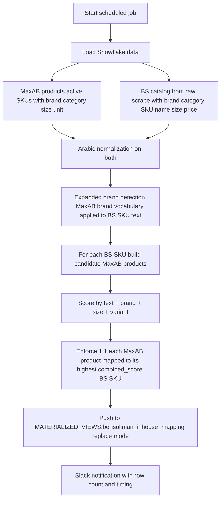

# Ben Soliman SKU Mapping Pipeline

## Purpose

Daily refresh job that maps Ben Soliman (BS) SKUs to MaxAB products via fuzzy matching, then publishes a 1:1 lookup table to `MATERIALIZED_VIEWS.bensoliman_inhouse_mapping`. The output is consumed by `market_data_module_2` as one of its three competitor price sources (the in-house mapping path, alongside the savvy-mapping path).

Lives at `Mustafa/Mapping/bs_mapping_pipeline.ipynb`. Companion to `sku_mapping_pipeline.ipynb` (which handles the multi-source competitor mapping — see `Mapping/README.md` for that one).

---

## Flow

---

## Why BS-specific (separate from sku_mapping_pipeline)

`sku_mapping_pipeline.ipynb` handles competitor scraped data from 4 apps (Cartona, Tawfeer, Speed, Talabia) and writes to `competitors_mapping_fixed`. BS is a different source with different structure (catalog with brand+category+size fields rather than free-text product names), so it gets its own pipeline and its own output table.

The market data module reads BOTH:
- `competitors_mapping_fixed` (Cartona/Tawfeer/Speed/Talabia)
- `bensoliman_inhouse_mapping` (this pipeline)

---

## Matching algorithm

Same Arabic NLP foundation as `sku_mapping_pipeline.md` (diacritics, alef normalization, taa marbuta, eastern digits, measurement normalization, AWN synonyms), with these BS-specific tweaks:

| Step | Description |
|---|---|
| **Brand detection** | Both BS and MaxAB have brand fields; primary path is exact -> subset -> fuzzy >= 90 match. Falls back to scanning BS SKU text against MaxAB brand vocabulary. |
| **Category compatibility** | BS category vs MaxAB category via vocabulary + AWN synonyms. |
| **Size compatibility** | BS size field parsed and compared with +/-15% tolerance. |
| **Variant conflict** | Detects flavor/color/type mismatches. |
| **Text similarity** | `text_sim` from `rapidfuzz` (token_sort_ratio, token_set_ratio, partial_ratio weighted). |
| **Combined score** | text + brand + size (- variant penalty if conflict). |

### 1:1 enforcement

Each MaxAB product is mapped to exactly **one** BS SKU — the one with the highest `combined_score`. If multiple BS SKUs match the same MaxAB product, only the top-scored pair survives. This is what the market data module assumes when it joins.

---

## Output table

`MATERIALIZED_VIEWS.bensoliman_inhouse_mapping` (replace mode, full rebuild every run):

| Column | Type | Description |
|---|---|---|
| `maxab_product_id` | int | MaxAB product key |
| `bs_sku_id` | str | Ben Soliman SKU identifier |
| `bs_sku_name` | str | BS product name |
| `bs_brand` | str | BS brand |
| `bs_category` | str | BS category |
| `bs_price` | float | Latest scraped BS price |
| `combined_score` | float | Match score (audit field) |
| `mapped_at` | timestamp | Run timestamp (Cairo) |

---

## Inputs / Outputs

### Inputs
| Source | Data |
|---|---|
| Snowflake — MaxAB products | Active SKUs with brand, category, size, unit |
| Snowflake — BS raw catalog | Latest scraped BS catalog with brand, category, name, size, price |

### Outputs
| Output | Destination |
|---|---|
| `bensoliman_inhouse_mapping` | Snowflake `MATERIALIZED_VIEWS` schema (replace) |
| Slack summary | `new-pricing-logic` channel |

---

## Schedule

Runs daily at **04:30 Cairo** (before `data_extraction` at 05:30, so the V2 market data has the freshest BS mapping).

---

## Configuration

| Parameter | Value | Description |
|---|---|---|
| Brand fuzzy threshold | 90 | Min score for fuzzy brand match |
| Text sim min | 45 | Min text similarity to consider candidate |
| Size tolerance | 15% | Allowed size deviation |
| Output mode | replace | Full rebuild every run |

---

## Dependencies

| Direction | Module |
|---|---|
| **Requires** | `setup_environment_2`, `rapidfuzz`, `wn` (Arabic WordNet), `snowflake-connector-python`, MaxAB brand/category vocabulary in helpers |
| **Consumed by** | `market_data_module_2.get_market_data_v2()` (in-house BS path) |
| **External** | Snowflake (read MaxAB products + BS catalog, write mapping table), Slack |
