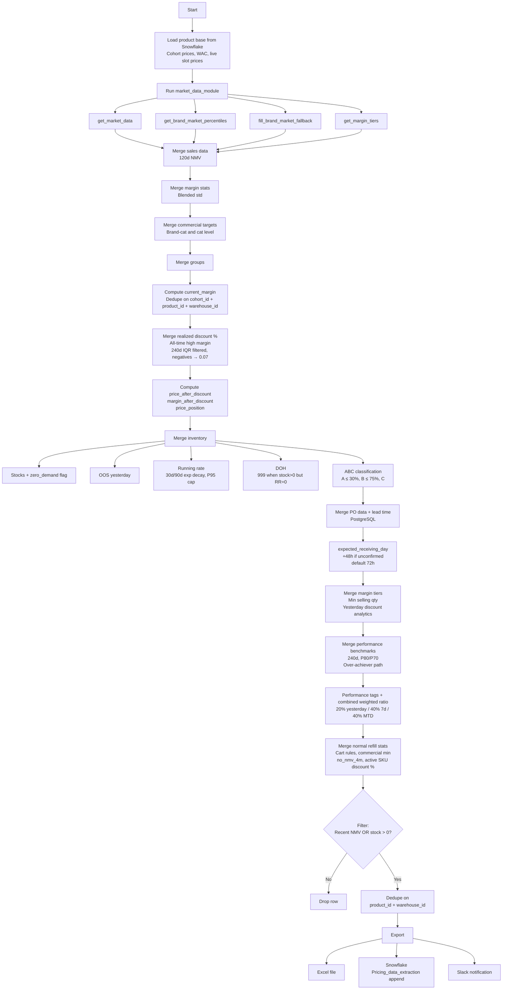

# Data Extraction Module

## Purpose

Builds a wide warehouse-SKU level dataset from 20+ Snowflake queries, enriched with market data, inventory metrics, performance benchmarks, and commercial rules. This is the foundational data layer — every pricing module downstream reads from its output table `Pricing_data_extraction`.

---

## Flow Diagram

---

## Key Computed Fields

| Field | Computation |
|-------|-------------|
| `price_position` | Below Market / At Market / Above Market — based on where current price falls in market band |
| `performance_tag` | Star Performer / On Track / Underperformer / Critical — from benchmark ratios |
| `DOH` | Days on Hand = stock / running_rate; `999` when stock > 0 but running_rate = 0 |
| `running_rate` | 30d/90d exponential decay blend, capped at P95 |
| `ABC` | A ≤ 30% cumulative NMV, B ≤ 75%, C = rest |
| `expected_receiving_day` | From PO data + lead time; +48h if unconfirmed; default 72h |
| `combined_weighted_ratio` | 20% yesterday + 40% 7-day + 40% MTD performance ratio |
| `all_time_high_margin` | IQR-filtered 240-day max margin; negatives clipped to 0.07 |

---

## Key Functions

| Function | Description |
|----------|-------------|
| Product base loader | Queries Snowflake for cohort prices, WAC, live slot prices |
| Market data pipeline | Calls `get_market_data()`, `get_brand_market_percentiles()`, `fill_brand_market_fallback()`, `get_margin_tiers()` |
| Inventory merger | Stocks, zero demand, OOS, running rate, DOH, ABC classification |
| PO + lead time merger | PostgreSQL join for PO data and expected receiving dates |
| Performance benchmark merger | 240-day P80/P70 benchmarks, over-achiever path, tags, weighted ratio |
| Export pipeline | Excel + Snowflake append + Slack notification |

---

## Inputs / Outputs

### Inputs
| Source | Data |
|--------|------|
| Snowflake | Product base, sales (120d NMV), margins, commercial targets, groups, discounts, inventory, benchmarks, cart rules |
| PostgreSQL | PO data, lead time |
| Market Data Module | Market prices, margin tiers, brand percentiles |

### Outputs
| Output | Destination |
|--------|-------------|
| `Pricing_data_extraction` | Snowflake table (append mode) |
| Excel export | Local file |
| Slack summary | Slack channel notification |

---

## Processing Pipeline Summary

| Step | Description |
|------|-------------|
| 1 | Load product base (cohort prices, WAC, slot prices) |
| 2 | Run market data module (4 functions) |
| 3 | Merge sales (120d NMV), margin stats (blended std), commercial targets, groups |
| 4 | Compute `current_margin`, dedupe on `(cohort_id, product_id, warehouse_id)` |
| 5 | Merge realized discount %, all-time high margin, price/margin after discount, price_position |
| 6 | Merge inventory: stocks, zero_demand, OOS, running_rate, DOH, ABC |
| 7 | Merge PO + lead time (PostgreSQL), compute expected_receiving_day |
| 8 | Merge margin tiers, min selling qty, yesterday discount analytics |
| 9 | Merge performance benchmarks (240d), performance tags, combined weighted ratio |
| 10 | Merge normal refill, cart rules, commercial min, no_nmv_4m, active SKU discount % |
| 11 | Filter: keep rows with recent NMV OR positive stock; dedupe on `(product_id, warehouse_id)` |
| 12 | Export: Excel + Snowflake + Slack |

---

## Dependencies

| Direction | Module |
|-----------|--------|
| **Requires** | `setup_environment_2` (env), `common_functions` (upload, Slack), `market_data_module` |
| **Databases** | Snowflake (primary), PostgreSQL (PO / lead time) |
| **Consumed by** | `module_2_initial_price_push`, `module_3_periodic_actions`, `module_4_hourly_updates` |
