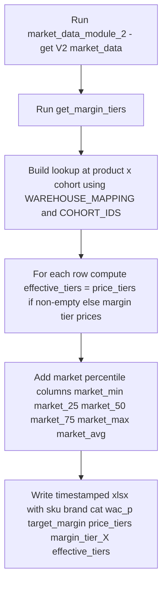

# Effective Tiers Export

## Purpose

Manual debug / audit tool that exports the `effective_tiers` for every (product, cohort) to an Excel file. Useful for spot-checking what tier ladder the pricing modules will actually walk for a given SKU.

Lives at `Mustafa/modules/effective_tiers_export.ipynb`.

---

## What it does

---

## Output columns

| Column | Description |
|---|---|
| `cohort_id`, `product_id` | Grain |
| `sku`, `brand`, `cat` | Identifiers |
| `wac_p` | Working average cost |
| `target_margin` | Brand+cat or cat fallback |
| `price_tiers` | V2 market price list (sorted ascending) |
| `margin_tier_below`, `margin_tier_1` to `margin_tier_5`, `margin_tier_above_1`, `margin_tier_above_2` | Margin values from `get_margin_tiers()` (warehouse-aggregated to cohort by mean) |
| `effective_tiers` | The unified ladder: `price_tiers` if non-empty, else margin tiers converted to prices via `wac/(1-margin)` |
| `market_min`, `market_25`, `market_50`, `market_75`, `market_max`, `market_avg` | Percentiles derived from `price_tiers` |

---

## Usage

1. Open the notebook.
2. Run all cells.
3. Output written to `effective_tiers_export_YYYYMMDD_HHMM.xlsx` in the working directory.
4. Open in Excel, filter by SKU / brand / cat to audit.

---

## Why this exists

Pricing decisions across all modules walk `effective_tiers`. When a price action looks wrong in production, the first question is "what did the tier ladder look like for that SKU at that time?". This script makes that question answerable in 30 seconds without re-running a whole module.

---

## Dependencies

| Direction | Module |
|---|---|
| **Requires** | `setup_environment_2`, `db.py`, `constants.py` (`WAREHOUSE_MAPPING`, `COHORT_IDS`), `market_data_module_2` (`get_market_data_v2`, `get_margin_tiers`, `expand_to_cohorts`), `queries_module` |
| **External** | Snowflake (V2 market data), local xlsx |
