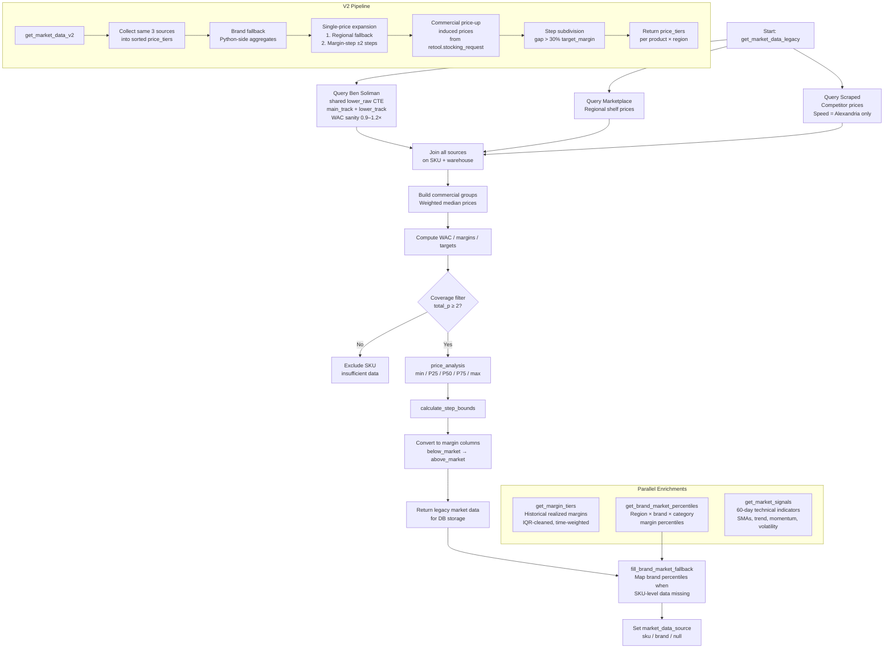
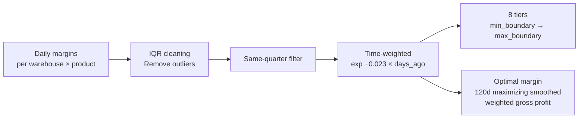

# Market Data Module

## Purpose

Shared data layer that collects competitor and market prices from three independent sources (Ben Soliman, Marketplace, Scraped) and builds a unified margin context for downstream pricing decisions. Requires no caller inputs — all data is sourced directly from Snowflake. Produces market price bands, margin tiers, brand-level fallbacks, and technical market signals consumed by every other module.

---

## Flow Diagram

---

## Price Sources

| Source | Description | Filtering | Fallback |
|--------|-------------|-----------|----------|
| **Ben Soliman** | Shared `lower_raw` CTE feeds two tracks: `main_track` (primary reference price) and `lower_track` (cheaper alternative). WAC sanity check rejects rows where price falls outside 0.9–1.2× WAC | WAC sanity 0.9–1.2× | — |
| **Marketplace** | Regional online shelf prices | ±40% WAC filter, IQR cleaning | Regional fallback |
| **Scraped** | Competitor prices matched to SKUs. **Speed = Alexandria only** | Regional fallback priorities | Percentile-based |

**Coverage rule:** `total_p ≥ 2` — Points: Ben = 1, Marketplace = 1–3, Scraped = 1–5.

---

## Key Functions

| Function | Description |
|----------|-------------|
| `get_market_data_legacy()` | Legacy pipeline (same DB output as V1): query 3 sources → join → commercial groups (weighted median) → WAC/margins/targets → coverage filter → price analysis → step bounds → margin columns. Called internally by V2 to preserve backward-compatible DB storage |
| `get_market_data_v2()` | V2 pipeline producing sorted `price_tiers` list per `(product_id, region)`. Two-stage single-price expansion: (1) regional fallback — borrow prices from neighboring regions, (2) margin-step expansion — ±2 steps centered on the single price. Includes brand fallback (Python-side aggregates), commercial price-up induced prices (from `retool.stocking_request`), and step subdivision (gap > 30% target_margin) |
| `get_margin_tiers()` | Historical realized margins by warehouse × product. IQR-cleaned, time-weighted with exponential decay. Produces 8 tiers from `min_boundary` to `max_boundary` |
| `get_brand_market_percentiles()` | Region × brand × category margin percentiles used as fallback when SKU-level data is missing |
| `fill_brand_market_fallback()` | Maps brand percentiles to margin/price columns; sets `market_data_source` to `'sku'`, `'brand'`, or `null` |
| `get_market_signals()` | 60-day technical indicators from `Pricing_data_extraction`: SMAs, trend direction, momentum, volatility |

---

## Margin Tiers Detail

- Exponential decay factor: `exp(-0.023 × days_ago)`
- Optimal margin: 120-day window maximizing smoothed weighted gross profit

---

## Inputs / Outputs

### Inputs
| Source | Data |
|--------|------|
| Snowflake — Ben Soliman | Reference prices, COGS (shared `lower_raw` CTE → `main_track` + `lower_track`) |
| Snowflake — Marketplace | Regional shelf prices |
| Snowflake — Scraped | Competitor matched prices (Speed = Alexandria only) |
| Snowflake — `retool.stocking_request` | Commercial price-up forecasts (V2 induced prices) |
| Snowflake — Pricing_data_extraction | 60-day price history for signals |
| Snowflake — Daily margins | Realized margin history |

### Outputs
| Output | Description |
|--------|-------------|
| Legacy market data DataFrame | Price bands (min/P25/P50/P75/max), margin columns (below_market → above_market), step bounds — from `get_market_data_legacy()` |
| V2 price tiers DataFrame | Sorted `price_tiers` list per `(product_id, region)` — from `get_market_data_v2()` |
| Margin tiers DataFrame | 8-tier ladder per warehouse × product |
| Brand percentiles DataFrame | Region × brand × category margin percentiles |
| Market signals DataFrame | SMA, trend, momentum, volatility per SKU |
| `market_data_source` flag | `'sku'` / `'brand'` / `null` per row |

---

## Configuration

| Parameter | Value | Description |
|-----------|-------|-------------|
| Coverage threshold | `total_p ≥ 2` | Minimum source score to include a SKU |
| Ben Soliman weight | 1 point | Coverage contribution |
| Marketplace weight | 1–3 points | Coverage contribution |
| Scraped weight | 1–5 points | Coverage contribution |
| Decay constant | 0.023 | Exponential decay for time-weighting margins |
| Optimal margin window | 120 days | Lookback for gross-profit-maximizing margin |
| Marketplace WAC filter | ±40% | Reject shelf prices outside this band |

---

## V2 Enrichment Detail

| Stage | Description |
|-------|-------------|
| **Brand fallback** | Python-side fallback for SKUs with no market data — uses brand-level price aggregates to populate tiers |
| **Single-price expansion** | Two-stage: (1) regional fallback borrows prices from neighboring regions; (2) margin-step expansion generates ±2 steps centered on the single price |
| **Commercial price-up** | Induced prices sourced from `retool.stocking_request` via `get_commercial_price_ups()` — injected as additional tier anchors |
| **Step subdivision** | Tiers are subdivided when the gap between consecutive prices implies > 30% of `target_margin` |

---

## Dependencies

| Direction | Module |
|-----------|--------|
| **Requires** | `setup_environment_2` (environment configuration), `queries_module` (`get_commercial_price_ups()`) |
| **Consumed by** | `data_extraction` (via `get_market_data_legacy()`), `module_2_initial_price_push`, `module_3_periodic_actions`, `module_4_hourly_updates`, `manual_price_push` (via `get_market_data_v2()`) |
