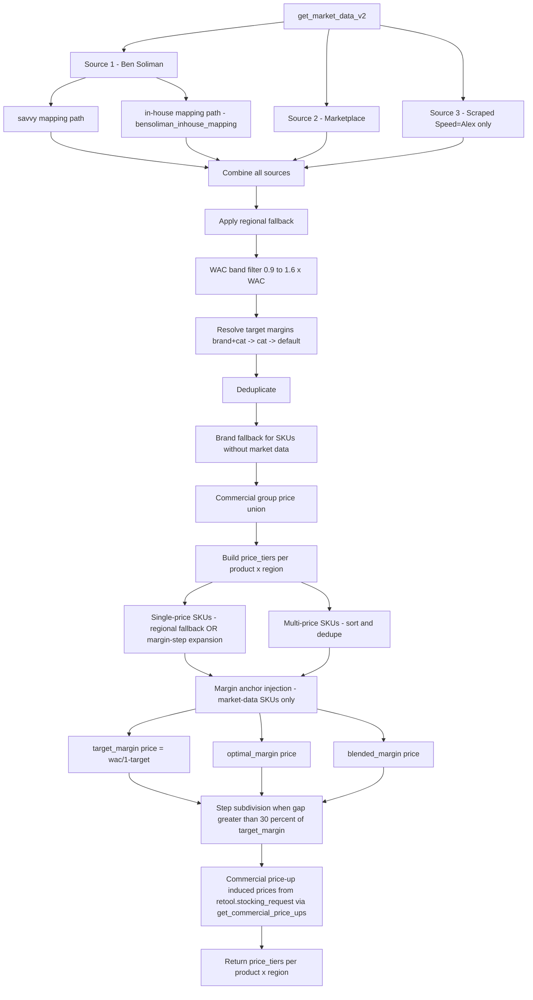
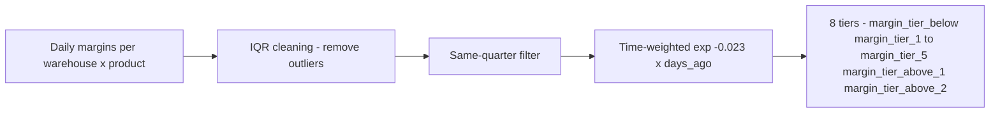

# Market Data Module V2 — Standalone Pipeline

## Purpose

V2 of the market data pipeline. Was originally a thin wrapper around `market_data_module.ipynb` (V1) but is now **fully standalone** — it inlines the legacy logic and adds margin anchor injection, brand fallback, single-price expansion, and commercial price-up induced prices. Outputs a sorted `price_tiers` list per `(product_id, region)` consumed by every pricing module via `effective_tiers`.

Coexists with the legacy V1 module (`market_data_module.ipynb`) which is still used by `data_extraction` for backward-compatible DB storage. New pricing logic uses V2 directly.

---

## Why V2 is standalone

In earlier versions, V2 called `%run market_data_module.ipynb` to bootstrap V1 functions and then layered V2 transformations on top. This forced both pipelines to load every time. The current V2 inlines what it needs:

- Three source queries (Ben Soliman, Marketplace, Scraped) implemented directly.
- Brand percentile fallback computed Python-side.
- No dependency on V1 functions for the V2 codepath. V1 is still imported separately by `data_extraction`.

This made it possible to call `get_market_data_v2()` once per module run instead of pre-running V1 + V2.

---

## Pipeline

---

## Sources

| Source | Description | Notes |
|---|---|---|
| **Ben Soliman (savvy)** | Pre-existing savvy mapping path | Direct join from MaxAB SKU to BS price |
| **Ben Soliman (in-house)** | `MATERIALIZED_VIEWS.bensoliman_inhouse_mapping` (built daily by `bs_mapping_pipeline.ipynb`) | Newer fuzzy-matched path with size/category/variant validation |
| **Marketplace** | Regional online shelf prices | +/-40% WAC filter, IQR cleaning |
| **Scraped** | Competitor prices from 4 apps via `competitors_mapping_fixed` | Speed = Alexandria only |

Coverage rule: `total_p >= 2`. Points: Ben = 1, Marketplace = 1-3, Scraped = 1-5.

---

## Margin anchor injection (KEY DIFFERENCE FROM V1)

After building `price_tiers`, V2 injects up to **three** anchor prices per (product, region) combination — but only for SKUs **with actual market data** (`market_data_source = 'sku'`); brand-fallback-only SKUs are left untouched.

| Anchor | Source | Formula |
|---|---|---|
| `target_margin` | `performance.commercial_targets` (brand+cat or cat fallback) | `wac / (1 - target_margin)` |
| `optimal_margin` | `get_optimal_blended_margins()` in `queries_module` (region-level rollup of optimal margin from finance) | `wac / (1 - optimal_margin)` |
| `blended_margin` | `get_optimal_blended_margins()` (region-level rollup of blended margin) | `wac / (1 - blended_margin)` |

All anchors are rounded to 0.25 EGP and must pass the WAC floor (>= 0.9 * WAC). Together they create "comfort zones" between the target / optimal / blended levels and the high market prices, so the subsequent step subdivision generates fine-grained tiers between them.

**ATH margin removed.** The earlier V2 used an all-time-high margin from raw `daily_margin_data` (240d IQR-filtered, max across warehouses). It was producing prices too high in practice and was replaced by `optimal_margin` + `blended_margin` (which come from a more conservative finance pipeline at region grain).

---

## Single-price expansion

When a SKU has only ONE market price observation, V2 generates additional tiers:

| Step | Method |
|---|---|
| 1. Regional fallback | Borrow tier prices from a neighboring region (same SKU) if available |
| 2. Margin-step expansion | If still a single price, generate +/-2 steps centered on the single price using the SKU's margin tier ladder |

These expanded SKUs are tagged so the consumer modules know the tiers are synthetic, not observed.

---

## Step subdivision

When the gap between consecutive prices in `price_tiers` implies a margin change > 30% of `target_margin`, V2 inserts intermediate prices to keep the ladder fine-grained. Prevents huge jumps between tiers (e.g. 100 EGP -> 150 EGP becomes 100 -> 115 -> 130 -> 150).

---

## Commercial price-up induced prices

After all tier construction, `get_commercial_price_ups()` (from `queries_module`) returns price-up forecasts from `retool.stocking_request` (price_up_date within 2 weeks, diff 2-50%). Each forecast injects an additional tier price to anticipate the upcoming COGS change.

---

## Margin tiers (separate function)

`get_margin_tiers()` is independent of the V2 pipeline. It returns 8 tiers per warehouse x product based on historical realized margins:

These are MARGIN values (e.g. 0.05 = 5%), not prices. Consumer modules convert via `wac / (1 - margin_tier_X)` when they need a price.

### Cascading boundary fallback

When warehouse-level boundaries are unusable (both `min_boundary` and `max_boundary` < 0, or no data), `get_margin_tiers()` falls back in order: warehouse -> region (`get_margin_boundaries_region()`) -> global (`get_margin_boundaries_global()`). A `boundary_source` column tracks provenance.

---

## `expand_to_cohorts()`

Helper that takes a (product_id, region) DataFrame and expands to (product_id, cohort_id) using `WAREHOUSE_MAPPING`. Used by every consumer module (M2/M3/M4/M5, manual_price_push, market_position_pricing).

---

## Key functions

| Function | Description |
|---|---|
| `get_market_data_v2()` | Main entry. Returns `(product_id, region, price_tiers, wac_p, target_margin, num_sources, market_data_source)` per SKU x region. |
| `get_market_data_legacy()` | V1 pipeline, inlined. Same DB output as V1 (price bands min/P25/P50/P75/max + margin columns). Used by `data_extraction` for backward-compatible storage. |
| `get_margin_tiers()` | 8-tier margin ladder per warehouse x product, IQR-cleaned and time-weighted. |
| `expand_to_cohorts(df)` | Expand per-region df to per-cohort df via WAREHOUSE_MAPPING. |
| `get_market_signals()` | 60d technical indicators (SMAs, trend, momentum, volatility) from `Pricing_data_extraction`. |
| `get_brand_market_percentiles()` | Region x brand x category margin percentiles (V1 fallback). |
| `fill_brand_market_fallback()` | Maps brand percentiles to margin/price columns; sets `market_data_source` to `'sku'` / `'brand'` / `null`. |
| `tiers_to_percentiles(tiers)` | Helper: converts a sorted price list into market_min / market_25 / market_50 / market_75 / market_max / market_avg. |

---

## Inputs / Outputs

### Inputs
| Source | Data |
|---|---|
| Snowflake — Ben Soliman savvy | Pre-existing savvy mapping prices |
| Snowflake — `MATERIALIZED_VIEWS.bensoliman_inhouse_mapping` | In-house BS mapping (built daily by `bs_mapping_pipeline.ipynb`) |
| Snowflake — Marketplace | Regional online shelf prices |
| Snowflake — `competitors_mapping_fixed` | Scraped 4-app prices |
| Snowflake — `finance.all_cogs` | WAC |
| Snowflake — `performance.commercial_targets` | Brand+cat / cat target margins |
| Snowflake — `retool.stocking_request` | Commercial price-up forecasts (via `get_commercial_price_ups()`) |
| `queries_module.get_optimal_blended_margins()` | Region-level optimal + blended margins (replaces ATH) |

### Outputs
| Output | Description |
|---|---|
| V2 price_tiers DataFrame | Sorted ascending `price_tiers` list per (product_id, region), plus `wac_p`, `target_margin`, `num_sources`, `market_data_source` |
| Legacy market data DataFrame | Min/P25/P50/P75/max + below_market/above_market margins (from `get_market_data_legacy()`) |
| Margin tiers DataFrame | 8-tier ladder per warehouse x product (from `get_margin_tiers()`) |
| Brand percentiles DataFrame | Region x brand x category margin percentiles |

---

## Configuration

| Parameter | Value | Description |
|---|---|---|
| Coverage threshold | `total_p >= 2` | Min source score to include a SKU |
| Marketplace WAC filter | +/-40% | Reject shelf prices outside this band |
| WAC band (final) | 0.9x to 1.6x WAC | Applied to all combined prices |
| Decay constant | 0.023 | Exponential decay for time-weighting margins |
| Optimal margin window | 120 days | Lookback for gross-profit-maximizing margin |
| Step subdivision threshold | 30% of `target_margin` | Insert intermediate price if gap exceeds this |
| Single-price expansion | +/-2 steps | Margin tier expansion centered on single price |

---

## Dependencies

| Direction | Module |
|---|---|
| **Requires** | `setup_environment_2`, `queries_module` (`get_commercial_price_ups`, `get_optimal_blended_margins`, `get_margin_boundaries_region`, `get_margin_boundaries_global`) |
| **Consumed by** | `data_extraction` (via `get_market_data_legacy()`), `module_2_initial_price_push`, `module_3_periodic_actions`, `module_4_hourly_updates`, `module_5_new_intros_invisible`, `manual_price_push`, `market_position_pricing`, `effective_tiers_export` |
