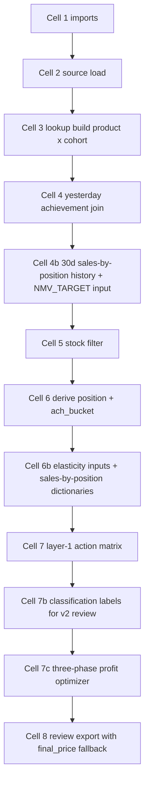
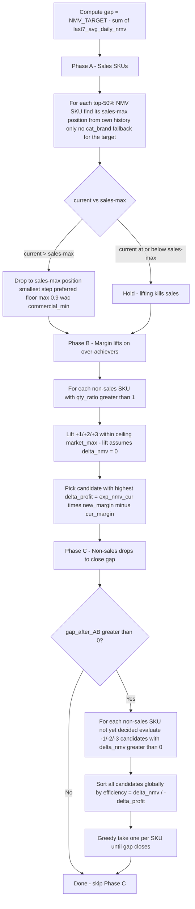

# Market Position Pricing — Manual Review Tool with Profit Optimizer

## Purpose

Manual-run notebook that proposes new prices for every (product, cohort) and writes them to a timestamped Excel for review. Two pricing layers run side-by-side:

1. **Layer 1 (Cell 7)** — position x achievement matrix. For each SKU, classify by market-percentile position and yesterday's `ach_bucket`, then move N steps in `effective_tiers`.
2. **Layer 2 (Cells 4b / 6b / 7b / 7c)** — margin-aware profit optimizer that respects the demand law (lifts never grow NMV) and uses 30 days of historical sales-by-position to maximize profit subject to a manual NMV target.

Output: a single xlsx with both layers' columns and a `final_price` fallback column (v2 wins; v1 used when v2 holds). **No API push.**

---

## Notebook structure

---

## Layer 1 — Position x Achievement Matrix (Cell 7)

For each (product, cohort), classify the SKU by its position in the market percentile band and yesterday's achievement bucket (`qty_ratio = yest_qty / p80_target`), then move N steps in the SKU's effective tier ladder.

### Action matrix

| pos | low (<0.9) | mid (0.9 to 2.0) | high (>=2.0) |
|---|---|---|---|
| min | HOLD | HOLD | +2 |
| 25 | -1 | -1 | +1 |
| 50 | -2 | -1 | +1 |
| 75 | -3 | -3 | HOLD |
| max | -3 | -2 | HOLD |
| Target margin<target | -2 | -2 | +2 |
| Target margin>=target | -2 | -1 | HOLD |
| below_min | exact `commercial_min` | exact `commercial_min` | exact `commercial_min` |

### Margin step bound

`0.1 * target_margin <= |delta_margin| <= 0.5 * target_margin`. If a step's implied margin change is outside this band, the candidate is clamped back to the band boundary.

### Floors

`0.9 * wac_p` hard floor; `commercial_min_price` takes precedence when set.

### Output columns (layer 1)

`reason`, `new_price`, `steps`, plus `delta` and `delta_pct` computed in the export cell.

---

## Layer 2 — Profit-maximizing optimizer

### Core principle

**Lifting price never increases NMV.** For lifts the optimizer uses the historical NMV at the candidate position (cat_brand fallback scaled by `sku_anchor`) and **caps the predicted change at zero** so noisy history can't project a phantom NMV gain. The optimizer then **picks the lift that minimizes the NMV drop** subject to remaining profitable. Drops can grow NMV via real elasticity from history.

### Step range

All moves walk at most `STEP_CAP = 7` tiers up or down in `effective_tiers` per SKU per run.

### Manual input

`NMV_TARGET` (top of Cell 4b) — single national EGP number for today. Set to `0` to skip Phase C (no gap-closing drops).

### Data preparation (Cells 4b, 6b)

| Step | What |
|---|---|
| 4b | Pull 30d historical price_position from `MATERIALIZED_VIEWS.Pricing_data_extraction` (column `created_at`), inner-join with 30d daily sales from `product_sales_order`, roll up to cohort. Build `sales_by_pos` (per cohort, product, position), `nmv_30d` (per cohort, product totals), `last7_avg_daily_nmv` (today's baseline). |
| 6b | Compute `nmv_share`, `is_bottom_quartile`, `is_top50_cum` flags within each cohort. Build a **scale-aware fallback**: cat_brand `position_index` = `avg_daily_nmv[position] / cb_pool_avg`, then `expected_at_P = sku_anchor * index_for_P`. Cap at `NMV_PREDICTION_CAP * sku_anchor` (default 5x). |

`sku_nmv_anchor = max(nmv_30d/30, last7_avg_daily_nmv)` — the SKU's own scale, used both for the cap and for fallback scaling.

### Position label normalization

`Pricing_data_extraction` stores positions as `"At Min"`, `"At 25th"`, etc. Cell 4b normalizes via `POSITION_LABEL_MAP`:

| Extraction string | Our label |
|---|---|
| `Below Market`, `Below Min` | `below_min` |
| `At Min` | `min` |
| `At 25th` | `25` |
| `At 50th` | `50` |
| `At 75th` | `75` |
| `At Max`, `Above Market` | `max` |
| `No Market Data` | `Target` |

If the extraction adds a new label, Cell 4b prints a WARNING — add it to the map.

### Three phases

| Phase | Universe | Action | Constraint |
|---|---|---|---|
| A | sales SKUs (top-50% cumulative cohort NMV) | Drop toward sales-max position if currently above; else hold | Never lifts; up to -`STEP_CAP` (=7) steps |
| B | non-sales SKUs with `qty_ratio > 1` | Lift +1 to +`STEP_CAP`. For each candidate compute `delta_nmv = min(0, hist_at_new - hist_at_cur)` and `delta_profit`. Skip if `delta_profit <= 0`. Pick the candidate with **highest efficiency = `delta_profit / max(-delta_nmv, eps)`** -- minimizes the NMV drop while keeping profit | Capped at `market_max`; `delta_nmv_v2 <= 0` (counts against gap) |
| C | remaining non-sales SKUs | Drop -1 to -`STEP_CAP` to close NMV gap | Sorted by efficiency = `delta_nmv / -delta_profit`; one move per SKU; floor `max(0.9*wac, commercial_min)` |

### Sales-max position lookup

For Phase A, `find_sku_sales_max_position(cohort, product)` returns the position label where this SKU's own historical `avg_daily_nmv` was highest (from `sbp_sku` only — no cat_brand fallback for the target). If no own history, the SKU holds with `sales_hold_no_own_history`.

### `reason_v2` vocabulary

| Prefix / suffix | Meaning |
|---|---|
| `sales_drop_to_<pos>_step_-N_smax=<pos>` | Phase A drop to sales-max |
| `sales_hold_at_or_below_max_(cur=<pos>,smax=<pos>)` | Phase A hold (already optimal for sales) |
| `sales_hold_no_own_history` | Phase A hold (no usable own history) |
| `sales_below_min_handled_by_matrix` | matrix in Cell 7 lifts to commercial_min; v2 stays out |
| `sales_no_tiers` | no `effective_tiers` |
| `sales_no_drop_within_floor` | every drop candidate violated the floor |
| `margin_lift_step_+N_to_<pos>_overachiever_drop_<X>` | Phase B lift; `X` is the rounded NMV drop in EGP/day |
| `p3_close_gap_step_-N_to_<pos>` | Phase C drop |
| `v2_held_no_better_move` | non-sales SKU with history but no profitable move |
| `none_no_30d_sales` | no 30d sales, optimizer skipped |
| `_floored` suffix | chosen price was clamped up to `max(0.9 * wac_p, commercial_min_price)` |

---

## Final recommendation (Cell 8)

The export adds a fallback layer on top of both:

| Column | Logic |
|---|---|
| `final_source` | `'v2'` if v2 acted, `'v1'` if v1 matrix acted (and v2 held), `'hold'` if both held (won't appear in export) |
| `final_price` | `new_price_v2` if not NaN, else `new_price` |
| `final_reason` | `reason_v2` if v2 acted, else `reason` |
| `final_delta`, `final_delta_pct` | vs `current_price` |

Export filter: keeps any row where v1 OR v2 has an action and `new_price != current_price`.

---

## Cells in detail

| Cell | Purpose |
|---|---|
| 1 | Imports + `NMV_TARGET = 0` placeholder. Loads `setup_environment_2`, `db.query_snowflake`, `db.get_snowflake_timezone`. |
| 2 | Loads V2 market data, WAC, current prices (from `cohort_pricing_changes` only — DBDP is stopped), products, target margins, commercial_min, stocks, margin_tiers. |
| 3 | Builds `lookup` at (product x cohort): joins V2 market percentiles, target_margin (with brand+cat fallback to default 0.05), `current_price`, `commercial_min_price`, `total_stocks`. Then merges `df_margin_tiers_cohort` (warehouse to cohort by MEAN of margin values). |
| 4 | Reads `queries/achievment_yasterday.sql`, rolls up warehouse to cohort by summing `yest_qty` + `p80_target`, recomputes `qty_ratio` at cohort level. |
| 4b | 30d sales-by-position history (NEW). Pulls extraction snapshots + daily sales, joins, normalizes labels, rolls to cohort, builds `sales_by_pos` / `nmv_30d` / `last7`. |
| 5 | Filters `lookup` to (closing_stock>0 AND opening_stock>0) OR `current_price < commercial_min_price`. SKUs below commercial_min must always be lifted regardless of yesterday's stock. |
| 6 | `derive_position()` and `derive_ach_bucket()` applied to lookup. |
| 6b | Builds elasticity inputs and the scale-aware sales-by-position dictionary. |
| 7 | Layer 1 action matrix. Sets `new_price`, `reason`, `steps`. Two safety nets: `0.9*wac_p` floor, then `commercial_min_price` floor. |
| 7b | Layer 2 informational classification (`sales_or_margin`). Initializes `new_price_v2`, `delta_nmv_v2`, `delta_profit_v2` columns. |
| 7c | Three-phase optimizer. Sets `new_price_v2`, `delta_nmv_v2`, `delta_profit_v2`, `reason_v2` for SKUs the optimizer touches. Defense-in-depth floor at the end. |
| 8 | Filters to actionable rows, computes `delta_*`, builds `final_*` fallback columns, prints distributions, writes timestamped xlsx. |

---

## How to run

1. Open the notebook.
2. Edit `NMV_TARGET` at the top of Cell 4b (Cairo EGP for today).
3. Run cells 1 to 8 in order.
4. Inspect printouts: position-label coverage warning (Cell 4b), `sales_or_margin` distribution (Cell 7b), Phase A/B/C counts (Cell 7c), `final_source` distribution (Cell 8).
5. Open `market_position_pricing_review_YYYYMMDD_HHMM.xlsx` and review.

---

## Things to eyeball after each run

1. **`Joined sales x position` rows** in Cell 4b vs `Daily sales` rows. If much smaller, the inner-join with extraction snapshots dropped a lot of days/warehouses. The elasticity table is only as good as what survived.
2. **`WARNING: N rows have unmapped price_position labels`** in Cell 4b. If it fires, add the missing label to `POSITION_LABEL_MAP`.
3. **Phase B count** — should be > 0 if you have over-achievers. If 0, either nothing has `qty_ratio > 1` today or all over-achievers are in the sales pool.
4. **`Final delta_profit`** at the end of Cell 7c. Negative means Phase C drops dominated and burned profit; positive means Phase A + B did most of the work.
5. **`Remaining gap`** — if greater than 0, the non-sales pool was too small to close the target. Either bump `NMV_TARGET` down or relax the sales-max constraint.
6. **`final_source` distribution** in Cell 8 — what fraction of decisions came from v2 vs v1 fallback. If almost all v1, the optimizer is being too conservative (most SKUs lack history or hit holds).

---

## Configuration

| Parameter | Default | Description |
|---|---|---|
| `NMV_TARGET` | 0.0 | Today's national EGP target (set per run) |
| `NMV_PREDICTION_CAP` | 5.0 | Max prediction multiplier vs `sku_nmv_anchor` |
| `STEP_CAP` | 7 | Max steps in `effective_tiers` per move (any phase) |
| Floor | `max(0.9 * wac_p, commercial_min_price)` | Hard price floor |
| Ceiling | `market_max` (when market data exists) | Hard price ceiling |
| Cohorts | from `constants.COHORT_IDS` | 700, 701, 702, 703, 704, 1123, 1124, 1125, 1126 |

---

## Dependencies

| Direction | Module |
|---|---|
| **Requires** | `setup_environment_2`, `db.py` (`query_snowflake`, `get_snowflake_timezone`), `constants.py` (`WAREHOUSE_MAPPING`, `COHORT_IDS`), `market_data_module_2` (`get_market_data_v2`, `get_margin_tiers`, `expand_to_cohorts`) |
| **Reads from** | Snowflake (`MATERIALIZED_VIEWS.Pricing_data_extraction`, `cohort_pricing_changes`, `product_sales_order`, `finance.all_cogs`, `finance.minimum_prices`, `performance.commercial_targets`, `product_warehouse`), `queries/achievment_yasterday.sql` |
| **Writes to** | Local timestamped xlsx file (no API push) |
