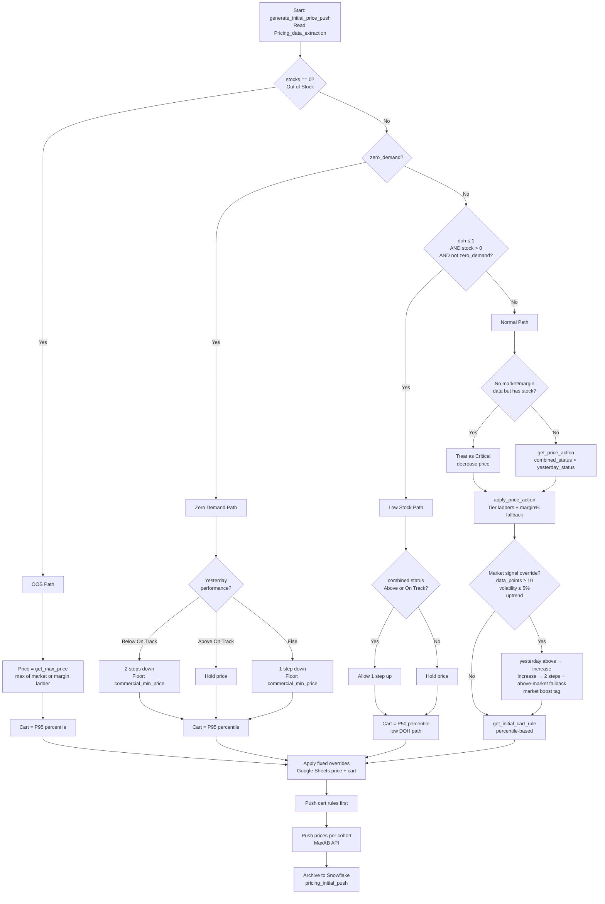
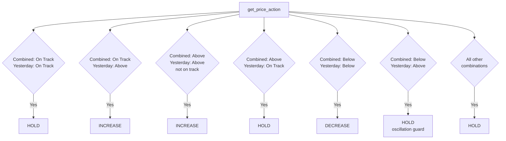
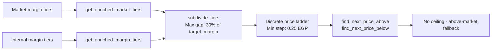

# Module 2 — Initial Price Push

## Purpose

Daily baseline price reset running at ~6–8 AM Cairo time. Reads `Pricing_data_extraction` and computes target prices using market/margin tier ladders. Establishes the starting price and cart rule for every SKU before intraday modules take over.

---

## Decision Tree — Full Flow

---

## Price Action Matrix (Normal Path)

---

## Tier System

- Prices move on discrete ladders: market tiers first, then internal margin tiers
- Tiers subdivided when gap exceeds 30% of `target_margin`
- Minimum step size: **0.25 EGP**
- No ceiling cap on increases — when all tiers exhausted, above-market fallback kicks in (avg margin step → 20% target margin → +1% bump)

---

## Key Functions

| Function | Description |
|----------|-------------|
| `generate_initial_price_push` | Main engine — reads extraction data, applies decision tree, outputs price + cart actions |
| `get_price_action` | Maps `(combined_status, yesterday_status)` → hold / increase / decrease |
| `apply_price_action` | Executes the action using tier ladders with margin% fallback on increases |
| `find_next_price_above` | Finds the next higher price on the tier ladder |
| `find_next_price_below` | Finds the next lower price on the tier ladder |
| `get_initial_cart_rule` | Computes cart rule from order-line percentiles |
| `get_max_price` | Returns max of market ladder or margin ladder price (for OOS) |
| `get_market_tiers` | Extracts market-based tier ladder for a SKU |
| `get_margin_tiers` | Extracts internal margin-based tier ladder |
| `get_enriched_market_tiers` | Market tiers with interpolated steps |
| `get_enriched_margin_tiers` | Margin tiers with interpolated steps |
| `subdivide_tiers` | Splits tier gaps exceeding 30% of target margin |
| `get_margin_increase_pct` | Determines margin % step for increase actions |
| `get_above_market_price` | Fallback price when tier ladders exhausted (avg margin step / 20% target / +1%) |

---

## Inputs / Outputs

### Inputs
| Source | Data |
|--------|------|
| Snowflake — `Pricing_data_extraction` | Full SKU dataset (market data, inventory, performance, margins) |
| Google Sheets — "Fixed Price" | Product-level fixed price and fixed cart overrides |
| Market/Margin tier ladders | From `market_data_module` output embedded in extraction |

### Outputs
| Output | Destination |
|--------|-------------|
| Cart rule updates | MaxAB API (pushed first) |
| Price updates per cohort | MaxAB API |
| `pricing_initial_push` | Snowflake archive table |

---

## Configuration

| Parameter | Value | Description |
|-----------|-------|-------------|
| `PUSH_MODE` | `testing` / `live` | Controls whether prices are actually pushed |
| `LOW_STOCK_DOH_THRESHOLD` | 1 | DOH threshold for low-stock path |
| `MIN_CART_RULE` | 10 | Minimum allowed cart rule |
| `MAX_CART_RULE` | 500 | Maximum allowed cart rule |
| `MIN_PRICE_CHANGE_EGP` | 0.25 | Smallest allowed price change |
| Tier subdivision threshold | 30% of `target_margin` | Max gap before tiers are subdivided |
| Market signal: min data points | 10 | Required for market signal override (yesterday above on track triggers hold→increase) |
| Market signal: max volatility | 5% | Volatility ceiling for signal eligibility |

---

## Dependencies

| Direction | Module |
|-----------|--------|
| **Requires** | `data_extraction` (Pricing_data_extraction table), `market_data_module` (tier ladders), `common_functions` (API upload, Slack), `setup_environment_2` |
| **External** | MaxAB API (price + cart push), Google Sheets (fixed overrides) |
| **Archives to** | Snowflake — `pricing_initial_push` |
