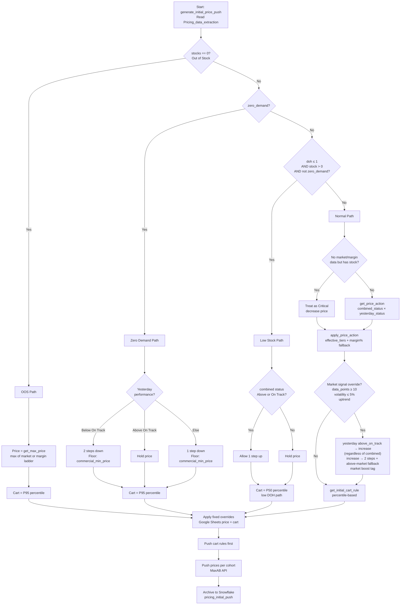
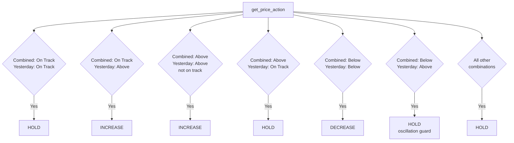
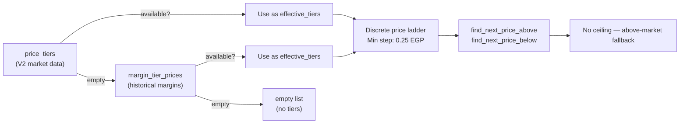

# Module 2 — Initial Price Push

## Purpose

Daily baseline price reset running at ~6–8 AM Cairo time. Reads `Pricing_data_extraction` and computes target prices using market/margin tier ladders. Establishes the starting price and cart rule for every SKU before intraday modules take over.

---

## Decision Tree — Full Flow

---

## Price Action Matrix (Normal Path)

---

## Price Action Summary

### Special Cases (evaluated first, in order)

| Condition | Action | Steps / Magnitude | Cart Rule | Floor / Notes |
|-----------|--------|-------------------|-----------|---------------|
| **OOS** (stock = 0) | Set to max tier | Jump to highest effective tier | P95 percentile | — |
| **Zero demand** + yesterday below On Track | Decrease | 2 steps down | P95 percentile | Floor: `commercial_min_price` |
| **Zero demand** + yesterday above On Track | Hold | — | P95 percentile | — |
| **Zero demand** + yesterday else | Decrease | 1 step down | P95 percentile | Floor: `commercial_min_price` |
| **Low stock** (DOH ≤ 1) + combined above/on track | Increase | 1 step up | P50 percentile | — |
| **Low stock** (DOH ≤ 1) + combined below | Hold | — | P50 percentile | — |
| **No market/margin data** but has stock | Treat as Critical | Decrease (1 step down) | Percentile-based | — |

### Normal Path — Performance Matrix

| Combined Status | Yesterday Status | Action | Steps |
|-----------------|-----------------|--------|-------|
| On Track | On Track | **Hold** | — |
| On Track | Above | **Increase** | 1 step up |
| Above | Above (not on track) | **Increase** | 1 step up |
| Above | On Track | **Hold** | — |
| Below | Below | **Decrease** | 1 step down |
| Below | Above | **Hold** | Oscillation guard |
| All other combinations | — | **Hold** | — |

### Market Signal Override (Normal Path only)

| Condition | Override Effect |
|-----------|----------------|
| Market signal valid (data_points ≥ 10, volatility ≤ 5%, uptrend) + yesterday above On Track + base action = hold | Upgrade to **increase** |
| Market signal valid + action = increase | Boost to **2 steps up** + above-market fallback if needed |
| No technical signal + commercial price-up ≥ 15% | Synthetic **STRONG UPTREND** (triggers same overrides) |
| No technical signal + commercial price-up 5–15% | Synthetic **UPTREND** (triggers same overrides) |
| No technical signal + commercial price-up < 5% | No signal |

### Above-Market Fallback (when tier ladder exhausted)

| Priority | Method |
|----------|--------|
| 1 | Average margin step between effective tiers → price from WAC |
| 2 | +20% of `target_margin` as margin step |
| 3 | +1% on current price, rounded to 0.25 EGP |

### Post-Processing

| Step | Action |
|------|--------|
| Fixed price override | Google Sheet value replaces computed price |
| Fixed cart override | Google Sheet value replaces computed cart |
| Push order | Cart rules first → then prices per cohort |

---

## Tier System — Effective Tiers

- All price movements use the unified **`effective_tiers`** list: `price_tiers` (V2) > `margin_tier_prices` > empty
- Minimum step size: **0.25 EGP**
- **No ATH ceiling cap** — prices can step beyond the top of the tier ladder
- When all tiers exhausted, `get_above_market_price()` computes the next price (avg margin step / 20% target margin / +1% bump)

---

## Key Functions

| Function | Description |
|----------|-------------|
| `generate_initial_price_push` | Main engine — reads extraction data, builds `effective_tiers` per SKU, applies decision tree, outputs price + cart actions |
| `get_price_action` | Maps `(combined_status, yesterday_status)` → hold / increase / decrease |
| `apply_price_action` | Executes the action using `effective_tiers` with margin% fallback on increases |
| `find_next_price_above` | Finds the next higher price on the effective tier ladder |
| `find_next_price_below` | Finds the next lower price on the effective tier ladder |
| `get_initial_cart_rule` | Computes cart rule from order-line percentiles |
| `get_max_price` | Returns max of effective tier ladder price (for OOS) |
| `get_margin_increase_pct` | Determines margin % step for increase actions |
| `get_above_market_price` | Fallback price when effective tiers exhausted (avg margin step / 20% target / +1%) |

---

## Inputs / Outputs

### Inputs
| Source | Data |
|--------|------|
| Snowflake — `Pricing_data_extraction` | Full SKU dataset (market data, inventory, performance, margins) |
| Google Sheets — "Fixed Price" | Product-level fixed price and fixed cart overrides |
| `effective_tiers` | Built from `price_tiers` (V2) > `margin_tier_prices` > empty — sourced from `market_data_module_2` output embedded in extraction |

### Outputs
| Output | Destination |
|--------|-------------|
| Cart rule updates | MaxAB API (pushed first) |
| Price updates per cohort | MaxAB API |
| `pricing_initial_push` | Snowflake archive table |

---

## Configuration

| Parameter | Value | Description |
|-----------|-------|-------------|
| `PUSH_MODE` | `testing` / `live` | Controls whether prices are actually pushed |
| `LOW_STOCK_DOH_THRESHOLD` | 1 | DOH threshold for low-stock path |
| `MIN_CART_RULE` | 10 | Minimum allowed cart rule |
| `MAX_CART_RULE` | 500 | Maximum allowed cart rule |
| `MIN_PRICE_CHANGE_EGP` | 0.25 | Smallest allowed price change |
| Market signal: min data points | 10 | Required for market signal override (yesterday above_on_track → increase, regardless of combined) |
| Market signal: max volatility | 5% | Volatility ceiling for signal eligibility |

---

## Market signal

When no market signal exists from technical indicators, Module 2 falls back to commercial price-up data (from `get_commercial_price_ups` in the queries module):

- **Diff below 5%:** no signal
- **5–15%:** UPTREND
- **15% or higher:** STRONG UPTREND

---

## Dependencies

| Direction | Module |
|-----------|--------|
| **Requires** | `data_extraction` (Pricing_data_extraction table), `market_data_module_2` (`effective_tiers` via `price_tiers` / `margin_tier_prices`), `queries_module` (`get_commercial_price_ups()`), `common_functions` (API upload, Slack), `setup_environment_2` |
| **External** | MaxAB API (price + cart push), Google Sheets (fixed overrides) |
| **Archives to** | Snowflake — `pricing_initial_push` |
