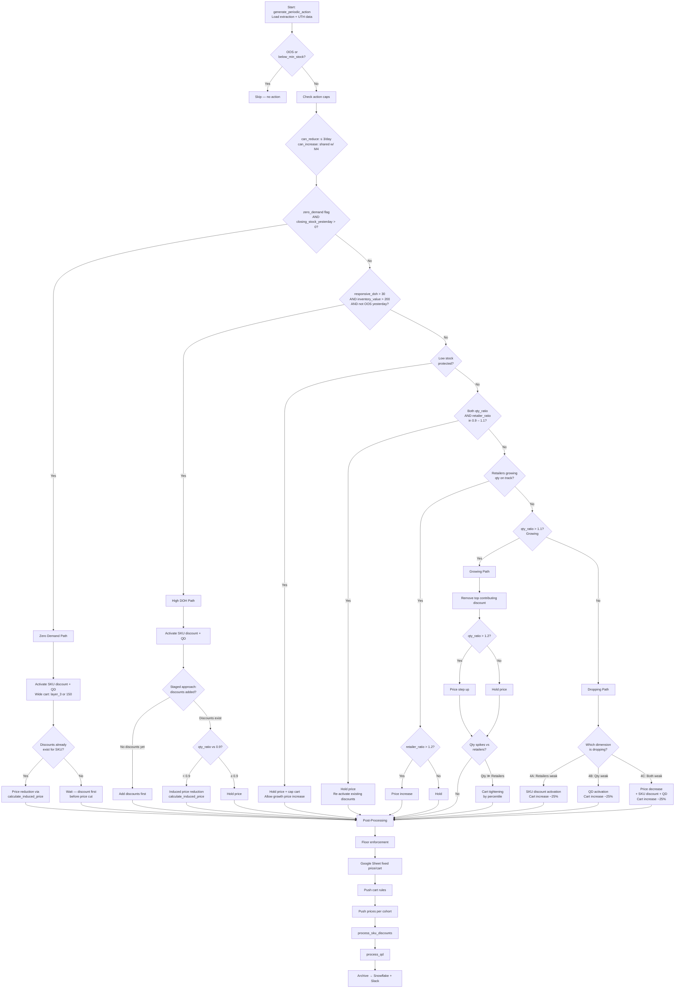
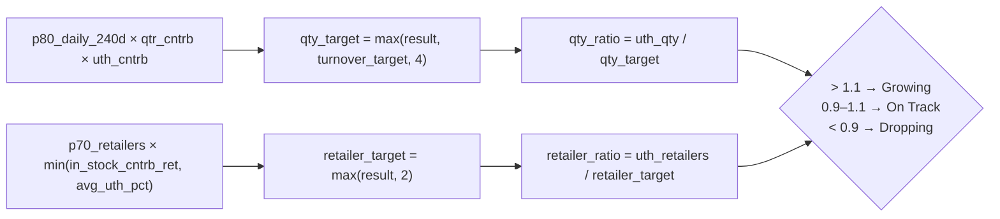

# Module 3 — Periodic Actions

## Purpose

Intraday UTH-based pricing engine running **5× daily** (12 PM, 3 PM, 6 PM, 9 PM, 12 AM Cairo). Compares real-time UTH (Up-To-Hour) performance against dynamic benchmarks and decides price changes, cart adjustments, SKU discounts, and quantity discounts. The primary responsive lever throughout the trading day.

---

## Full Decision Tree

---

## UTH Target Calculation

| Component | Formula |
|-----------|---------|
| `uth_cntrb` | `min(in_stock_contribution_qty, avg_uth_pct)` |
| `qty_target` | `max(p80_daily_240d × qtr_cntrb × uth_cntrb, turnover_target, 4)` |
| `retailer_target` | `max(p70_retailers × min(in_stock_cntrb_ret, avg_uth_pct), 2)` |
| `qty_ratio` | `uth_qty / qty_target` |
| `retailer_ratio` | `uth_retailers / retailer_target` |
| Growing | ratio > 1.1 |
| On Track | 0.9 ≤ ratio ≤ 1.1 |
| Dropping | ratio < 0.9 |

---

## Key Functions

| Function | Description |
|----------|-------------|
| `generate_periodic_action` | Core engine — loads data, computes UTH targets, applies decision tree, triggers all downstream actions |
| `load_previous_actions` | Retrieves today's earlier M3 actions to enforce caps and detect oscillation |
| `load_module4_increases_today` | Checks M4 increases to enforce shared daily cap |
| `calculate_induced_price` | Computes a reduced price induced by discount existence (for zero demand / high DOH) |
| `adjust_cart_rule` | Adjusts cart by ±25% |
| `get_current_percentile_level` | Identifies which order-line percentile the current cart sits at |
| `get_next_lower_percentile` | Returns the next more restrictive percentile level |
| `is_cart_too_open` | Validates cart isn't excessively wide relative to order patterns |
| `find_next_price_above` | Next higher price on tier ladder |
| `find_next_price_below` | Next lower price on tier ladder |

---

## Inputs / Outputs

### Inputs
| Source | Data |
|--------|------|
| Snowflake — `Pricing_data_extraction` | Base SKU dataset with market data, inventory, margins |
| Snowflake — UTH queries | Today's cumulative performance (excl. current hour) |
| Snowflake — Previous actions | Today's M3 + M4 actions for cap enforcement |
| Google Sheets | Fixed price / cart overrides |

### Outputs
| Output | Destination |
|--------|-------------|
| Price changes | MaxAB API (per cohort) |
| Cart rule changes | MaxAB API |
| SKU discount instructions | → `sku_discount_handler` |
| QD instructions | → `qd_handler` |
| Action archive | Snowflake + Slack |

---

## Configuration

| Parameter | Value | Description |
|-----------|-------|-------------|
| `UTH_GROWING_THRESHOLD` | 1.10 | Ratio above which status = Growing |
| `UTH_DROPPING_THRESHOLD` | 0.90 | Ratio below which status = Dropping |
| `QTY_PRICE_INCREASE_THRESHOLD` | 1.2 | qty_ratio above which price increase allowed |
| `QTY_PRICE_DECREASE_THRESHOLD` | 0.8 | qty_ratio below which price decrease triggered |
| `MAX_PRICE_REDUCTIONS_PER_DAY` | 3 | Daily cap on price decreases per SKU |
| `CART_INCREASE_PCT` | 0.25 | Cart adjustment step (25%) |
| `CART_DECREASE_PCT` | 0.25 | Cart adjustment step (25%) |
| `LOW_STOCK_DOH_THRESHOLD` | 1 | DOH threshold for low-stock protection |
| `MIN_CART_RULE` | 10 | Minimum cart rule value |
| `MAX_CART_RULE` | 300 | Maximum cart rule value |

---

## Schedule

| Run | Time (Cairo) |
|-----|-------------|
| 1 | 12:00 PM |
| 2 | 3:00 PM |
| 3 | 6:00 PM |
| 4 | 9:00 PM |
| 5 | 12:00 AM |

---

## Dependencies

| Direction | Module |
|-----------|--------|
| **Requires** | `data_extraction` (Pricing_data_extraction), `queries_module` (UTH, stocks, percentiles), `setup_environment_2`, `common_functions` |
| **Triggers** | `sku_discount_handler`, `qd_handler` |
| **Coordinates with** | `module_4_hourly_updates` (shared increase cap) |
| **Archives to** | Snowflake, Slack |
