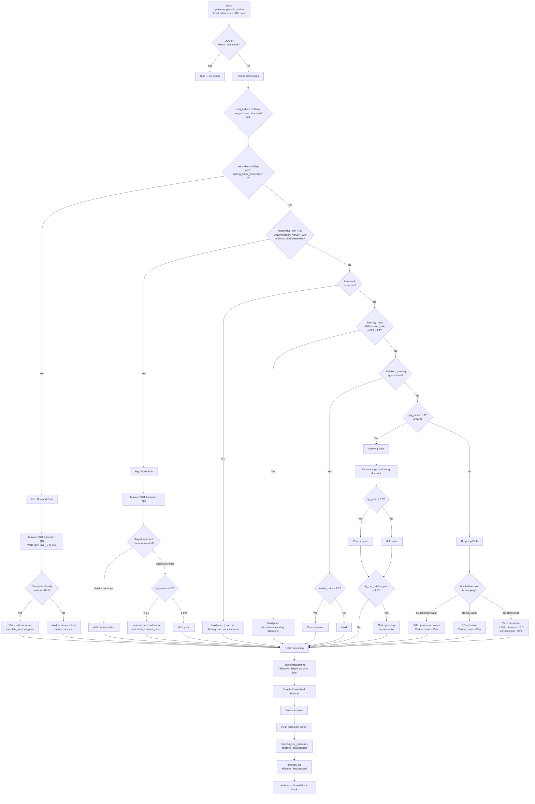
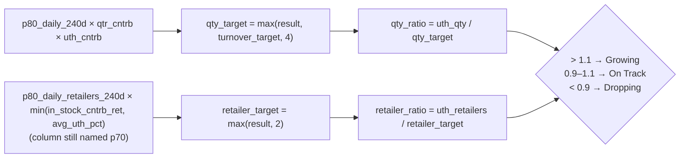

# Module 3 — Periodic Actions

## Purpose

Intraday UTH-based pricing engine running **3× daily** (12 PM, 5 PM, 11 PM Cairo). Compares real-time UTH (Up-To-Hour) performance against dynamic benchmarks and decides price changes, cart adjustments, SKU discounts, and quantity discounts. The primary responsive lever throughout the trading day.

---

## Full Decision Tree

---

## Price Action Summary

### Early Exits

| Condition | Action |
|-----------|--------|
| OOS (stock ≤ 0) | Skip — no action |
| Below minimum stock flag | Skip — no action |

### Zero Demand (zero_demand = 1, closing stock yesterday > 0)

| Condition | Price Action | Magnitude | Other Actions |
|-----------|-------------|-----------|---------------|
| Discounts already exist + can reduce | **Induced decrease** | 1 margin step down via `calculate_induced_price` | Activate SKU discount + QD; cart → max(layer_3, current, 100) or 150 |
| Discounts already exist + cannot reduce (hit daily cap) | **Hold** | — | Keep discounts + QD; wide cart |
| No discounts yet | **Hold** (discounts first) | — | Activate SKU discount + QD; wide cart; price cut deferred to next run |

### High DOH (responsive_doh > 30, inventory_value > 200, not OOS yesterday)

| Condition | Price Action | Magnitude | Other Actions |
|-----------|-------------|-----------|---------------|
| No SKU discount yet | **Hold** | — | Activate SKU discount + QD; wide cart |
| Has discount + qty_ratio ≥ 0.9 | **Hold** | — | Keep discounts; wide cart |
| Has discount + qty_ratio < 0.9 + can reduce | **Induced decrease** | 1 margin step down | Keep discounts; wide cart |
| Has discount + cannot reduce | **Hold** | — | Keep discounts; wide cart |

### Low Stock (DOH ≤ 1, uth_qty > 0)

| Condition | Price Action | Magnitude | Other Actions |
|-----------|-------------|-----------|---------------|
| qty_ratio > 1.1 + can increase + tier above exists | **Increase** | 1 step up | Cap cart to normal_refill + stddev |
| Otherwise | **Hold** | — | Cap cart to normal_refill + stddev |

### On Track (both qty_ratio and retailer_ratio in 0.9–1.1)

| Condition | Price Action | Other Actions |
|-----------|-------------|---------------|
| Both ratios in band | **Hold** | Re-activate existing SKU discount / QD if present |

### Retailers Growing, Qty On Track (qty 0.9–1.1, retailer_ratio > 1.1)

| Condition | Price Action | Magnitude |
|-----------|-------------|-----------|
| retailer_ratio > 1.2 + can increase + tier above exists | **Increase** | 1 step up |
| retailer_ratio ≤ 1.2 or cannot increase | **Hold** | — |

### Growing (qty_ratio > 1.1)

| Condition | Price Action | Magnitude | Other Actions |
|-----------|-------------|-----------|---------------|
| Has discounts + qty_ratio > 1.2 + can increase | Remove top discount + **Increase** | 1 step up | Cart tightening if qty_per_retailer_ratio > 1.3 |
| Has discounts + qty_ratio ≤ 1.2 | Remove top discount + **Hold** | — | Cart tightening if qty_per_retailer_ratio > 1.3 |
| No discounts + qty_ratio > 1.2 + can increase | **Increase** | 1 step up | Cart tightening if qty_per_retailer_ratio > 1.3 |
| No discounts + otherwise | **Hold** | — | Cart tightening if qty_per_retailer_ratio > 1.3 |

### Dropping (remaining cases)

| Sub-case | Condition | Price Action | Magnitude | Other Actions |
|----------|-----------|-------------|-----------|---------------|
| **4A** Retailers weak | No SKU discount | **Hold** | — | Activate SKU discount; cart +25% |
| **4A** Retailers weak | Has SKU discount + can reduce | **Decrease** | 1 step down | Keep discount; cart +25% |
| **4A** Retailers weak | Has SKU discount + cannot reduce | **Hold** | — | Keep discount; cart +25% |
| **4B** Qty weak | No QD | **Hold** | — | Activate QD; cart +25% |
| **4B** Qty weak | Has QD + qty_ratio < 0.8 + can reduce | **Decrease** | 1 step down | Keep QD; cart +25% |
| **4B** Qty weak | Has QD + qty_ratio ≥ 0.8 | **Hold** | — | Keep QD; cart +25% |
| **4C** Both weak | No SKU discount | **Hold** | — | Activate SKU discount; cart +25% |
| **4C** Both weak | Has discount + (qty < 0.8 or ret < 0.8) + can reduce | **Decrease** | 1 step down | Keep discount; cart +25% |
| **4C** Both weak | Has discount + both ratios ≥ 0.8 | **Hold** | — | Keep discount; cart +25% |

### Post-Processing

| Step | Action |
|------|--------|
| Price floor enforcement | Raise to `effective_tiers[0]` if below (excludes zero demand / high DOH) |
| Fixed price override | Google Sheet value replaces computed price |
| Fixed cart override | Google Sheet value replaces computed cart |
| Push order | Cart rules → prices → SKU discounts → QDs |

### Daily Caps

| Cap | Value |
|-----|-------|
| Max price reductions per day | 3 per SKU |
| Max price increases per day | Shared with Module 4 (same cap) |

---

## UTH Target Calculation

| Component | Formula |
|-----------|---------|
| `uth_cntrb` | `min(in_stock_contribution_qty, avg_uth_pct)` |
| `qty_target` | `max(p80_daily_240d × qtr_cntrb × uth_cntrb, turnover_target, 4)` |
| `retailer_target` | `max(p80_daily_retailers_240d × min(in_stock_cntrb_ret, avg_uth_pct), 2)` — column still named `p70` in the data but uses P80 calculation |
| `qty_ratio` | `uth_qty / qty_target` |
| `retailer_ratio` | `uth_retailers / retailer_target` |
| Growing | ratio > 1.1 |
| On Track | 0.9 ≤ ratio ≤ 1.1 |
| Dropping | ratio < 0.9 |

---

## Key Functions

| Function | Description |
|----------|-------------|
| `generate_periodic_action` | Core engine — loads data, computes UTH targets, applies decision tree, triggers all downstream actions |
| `load_previous_actions` | Retrieves today's earlier M3 actions to enforce caps and detect oscillation |
| `load_module4_increases_today` | Checks M4 increases to enforce shared daily cap |
| `calculate_induced_price` | Computes a reduced price induced by discount existence (for zero demand / high DOH) |
| `adjust_cart_rule` | Adjusts cart by ±25% |
| `get_current_percentile_level` | Identifies which order-line percentile the current cart sits at |
| `get_next_lower_percentile` | Returns the next more restrictive percentile level |
| `is_cart_too_open` | Validates cart isn't excessively wide relative to order patterns |
| `find_next_price_above` | Next higher price on tier ladder |
| `find_next_price_below` | Next lower price on tier ladder |

---

## Inputs / Outputs

### Inputs
| Source | Data |
|--------|------|
| Snowflake — `Pricing_data_extraction` | Base SKU dataset with market data, inventory, margins |
| Snowflake — `get_commercial_min_prices()` | Fresh commercial minimum prices from `finance.minimum_prices` each run (replaces relying on the morning extraction snapshot for this constraint) |
| Snowflake — UTH queries | Today's cumulative performance (excl. current hour) |
| Snowflake — Previous actions | Today's M3 + M4 actions for cap enforcement |
| Google Sheets | Fixed price / cart overrides |

### Outputs
| Output | Destination |
|--------|-------------|
| Price changes | MaxAB API (per cohort) |
| Cart rule changes | MaxAB API |
| SKU discount instructions | → `sku_discount_handler` |
| QD instructions | → `qd_handler` |
| Action archive | Snowflake + Slack |

---

## Effective Tiers

All pricing decisions use `effective_tiers` = `price_tiers` (V2) > `margin_tier_prices` > empty list. The effective tiers list is also passed to both the SKU discount handler and QD handler for tier-aware discounting.

---

## Commercial minimum prices

Each run refreshes commercial minimum constraints from `finance.minimum_prices` via `queries_module.get_commercial_min_prices()`, instead of relying on the morning `Pricing_data_extraction` snapshot for those values. Post-processing price floor enforcement uses `effective_tiers[0]` (the lowest tier price) as the price floor — not the legacy `market_min` column.

---

## Configuration

| Parameter | Value | Description |
|-----------|-------|-------------|
| `UTH_GROWING_THRESHOLD` | 1.10 | Ratio above which status = Growing |
| `UTH_DROPPING_THRESHOLD` | 0.90 | Ratio below which status = Dropping |
| `QTY_PRICE_INCREASE_THRESHOLD` | 1.2 | qty_ratio above which price increase allowed |
| `QTY_PRICE_DECREASE_THRESHOLD` | 0.8 | qty_ratio below which price decrease triggered |
| `MAX_PRICE_REDUCTIONS_PER_DAY` | 3 | Daily cap on price decreases per SKU |
| `CART_INCREASE_PCT` | 0.25 | Cart adjustment step (25%) |
| `CART_DECREASE_PCT` | 0.25 | Cart adjustment step (25%) |
| `LOW_STOCK_DOH_THRESHOLD` | 1 | DOH threshold for low-stock protection |
| `MIN_CART_RULE` | 10 | Minimum cart rule value |
| `MAX_CART_RULE` | 300 | Maximum cart rule value |

---

## Schedule

| Run | Time (Cairo) |
|-----|-------------|
| 1 | 12:00 PM |
| 2 | 5:00 PM |
| 3 | 11:00 PM |

---

## Dependencies

| Direction | Module |
|-----------|--------|
| **Requires** | `data_extraction` (Pricing_data_extraction), `queries_module` (UTH, stocks, percentiles, `get_commercial_min_prices`), `setup_environment_2`, `common_functions` |
| **Triggers** | `sku_discount_handler`, `qd_handler` |
| **Coordinates with** | `module_4_hourly_updates` (shared increase cap) |
| **Archives to** | Snowflake, Slack |
