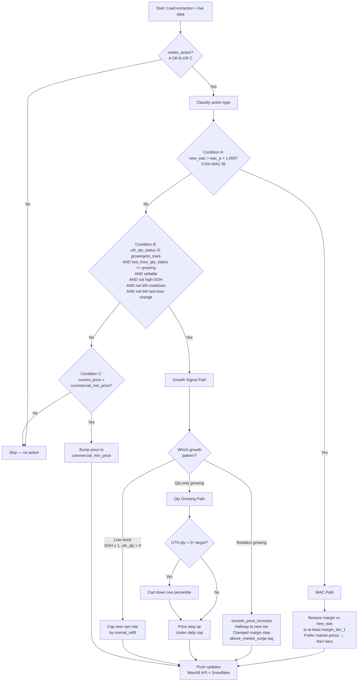
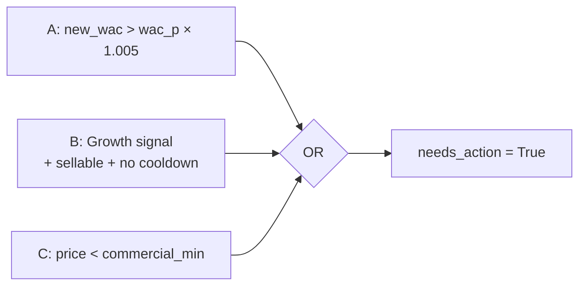
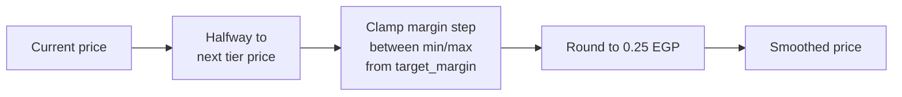

# Module 4 — Hourly Updates

## Purpose

Hourly price adjustments running on hours **between** Module 3 runs (1–2 PM, 4–5 PM, 7–8 PM, 10–11 PM, midnight, 3 AM). Focuses on three triggers: WAC changes from new purchases, growth-driven price increases, and commercial minimum enforcement. Operates as a lighter-weight complement to Module 3.

---

## Flow Diagram

---

## Action Eligibility

| Condition | Trigger | Description |
|-----------|---------|-------------|
| **A** | `new_wac > wac_p × 1.005` | WAC increased ≥ 0.5% from today's purchases |
| **B** | Growth + eligibility checks | UTH growing/on_track AND last hour growing AND sellable AND not high-DOH AND not M3/M4 cooldown |
| **C** | `current_price < commercial_min_price` | Price below commercial floor |

---

## Status Classification

| Status | Condition |
|--------|-----------|
| Growing | `ratio > 1.1` (UTH metric vs target) |
| On Track | `0.9 ≤ ratio ≤ 1.1` |
| Dropping | `ratio < 0.9` |

**Fixed ratio thresholds** (0.9 / 1.1), aligned with Module 3 — not ±1 standard deviation bands. Ratios compare realized UTH quantity or retailers to the same dynamic targets Module 3 uses.

---

## Smoothing Logic

`smooth_price_increase` moves the price halfway to the next tier, clamps the margin step between min and max derived from `target_margin`, and rounds to 0.25 EGP increments.

---

## Effective Tiers

All price actions use `effective_tiers` = `price_tiers` (V2) > `margin_tier_prices` > empty list, consistent with Module 3. Dead code removed: `get_status_std`, `subdivide_tiers` are no longer used — status classification uses fixed ratio thresholds (0.9 / 1.1), not ±1 standard deviation bands.

---

## Key Functions

| Function | Description |
|----------|-------------|
| Main hourly engine | Loads data, builds `effective_tiers`, classifies eligibility (A/B/C), applies price action per condition |
| `smooth_price_increase` | Halfway-to-next-tier on `effective_tiers` with margin clamping and 0.25 EGP rounding |
| Status classifier | Fixed ratio thresholds (0.9 / 1.1) vs UTH target, aligned with Module 3 |
| WAC path handler | Restores margin vs new WAC to at least `margin_tier_1`; prefers market prices from `effective_tiers` |
| Growth path handler | Retailers growing → smooth increase; qty growing → cart + price; low stock → cap cart |
| Commercial min handler | Bumps price to `commercial_min_price` (constraints loaded fresh each run via `get_commercial_min_prices()`, not from the morning extraction snapshot) |

---

## Inputs / Outputs

### Inputs
| Source | Data |
|--------|------|
| Snowflake — `Pricing_data_extraction` | Base SKU dataset |
| Snowflake — `get_commercial_min_prices()` | Fresh commercial minimum prices from `finance.minimum_prices` each run |
| Snowflake — UTH queries | Current-hour and last-hour performance |
| Snowflake — Today's M3/M4 actions | For cooldown and cap enforcement |
| Snowflake — Live WAC | Today's purchase-weighted average cost |

### Outputs
| Output | Destination |
|--------|-------------|
| Price updates | MaxAB API |
| Cart rule updates | MaxAB API (low stock path) |
| Action archive | Snowflake |

---

## Coordination & Cooldowns

| Rule | Value | Description |
|------|-------|-------------|
| M3 cooldown | 2 hours | No M4 action within 2h of a M3 action on same SKU |
| M4 self-cooldown | 1 hour | No back-to-back M4 changes on same SKU |
| Shared increase cap | Daily limit | M3 + M4 increases share a daily cap per SKU |
| `MAX_QTY_GROWING_PRICE_STEPS_PER_DAY` | 7 | Max growth-driven price steps per day |

---

## Configuration

| Parameter | Value | Description |
|-----------|-------|-------------|
| `UTH_GROWING_THRESHOLD` | 1.1 | Ratio above target → Growing (aligned with Module 3) |
| `UTH_DROPPING_THRESHOLD` | 0.90 | Ratio below target → Dropping (aligned with Module 3) |
| `LOW_STOCK_DOH_THRESHOLD` | 1 | DOH threshold for low stock path |
| `M3_COOLDOWN_HOURS` | 2 | Hours to wait after M3 action |
| WAC lift threshold | 0.5% (1.005×) | Minimum WAC increase to trigger action |
| Price rounding | 0.25 EGP | All prices rounded to nearest 0.25 |

---

## Schedule

Runs on hours **between** Module 3 slots:

| Hour (Cairo) | Module |
|-------------|--------|
| 12 PM | M3 |
| 1–4 PM | **M4** |
| 5 PM | M3 |
| 6–10 PM | **M4** |
| 11 PM | M3 |
| 12–3 AM | **M4** |
| 9–11 AM | **M4** |

---

## Dependencies

| Direction | Module |
|-----------|--------|
| **Requires** | `data_extraction`, `queries_module` (UTH, WAC, stocks, `get_commercial_min_prices`), `setup_environment_2`, `common_functions` |
| **Coordinates with** | `module_3_periodic_actions` (shared increase cap, cooldowns) |
| **Archives to** | Snowflake |
