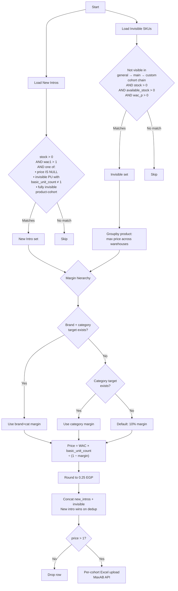

# Module 5 — New Intros, Invisible SKUs, and Under-Target-Margin

## Purpose

Standalone scheduled job that handles SKUs requiring first-time or corrective pricing. Targets **three** categories: products with stock but no price (new introductions), products that are invisible in the cohort chain despite having available stock, and products selling today below their target margin (corrective price-up). Ensures every sellable SKU has a valid price on the platform.

---

## Flow Diagram



---

## Three Buckets

### 1. New Intros
| Criteria | Condition |
|----------|-----------|
| Has stock | `stock > 0` |
| Has valid WAC | `wac1 > 1` |
| Needs pricing | `price IS NULL` OR invisible PU with `basic_unit_count ≠ 1` OR fully invisible product-cohort |

### 2. Invisible SKUs
| Criteria | Condition |
|----------|-----------|
| Not visible | Not in general → main → custom cohort chain |
| Has stock | `stock > 0` AND `available_stock > 0` |
| Has valid WAC | `wac_p > 0` |

### 3. Under-Target-Margin (NEW)

`UNDER_TARGET_MARGIN_QUERY` finds SKUs that are selling today, are NOT in `Pricing_data_extraction` (so M2/M3/M4 won't touch them), did NOT receive a price change today, and whose realized selling margin is below their `target_margin`. Pushes a corrective price computed at `wac / (1 - target_margin)`, rounded to 0.25 EGP.

| Criteria | Condition |
|----------|-----------|
| Selling today | At least one sale today (Cairo TZ via `CONVERT_TIMEZONE`) |
| Not in extraction | `product_id` NOT IN `Pricing_data_extraction` (today's snapshot) |
| No price change today | No row in `cohort_pricing_changes` today for this (cohort, product, basic PU) |
| Margin below target | Realized selling margin < `target_margin` |
| Active basic PU | `QUALIFY ROW_NUMBER() OVER (PARTITION BY cohort_id, product_id ORDER BY ... ) = 1` to pick the basic packing unit |

Default `target_margin` for the new-intros + invisible buckets and the under-target-margin bucket is **0.06** (was a mix of 0.05/0.06/0.10 before — unified per A7 of the cross-module audit).

---

## Price Formula

```
Price = WAC × basic_unit_count ÷ (1 − margin)
```

Rounded to **0.25 EGP**.

### Margin Hierarchy

| Priority | Source | Fallback |
|----------|--------|----------|
| 1 | Brand + category target | — |
| 2 | Category target | — |
| 3 | Default | **6%** (unified across all M5 paths; was 10% in older versions) |

---

## Key Functions

| Function | Description |
|----------|-------------|
| New intros loader | Queries Snowflake for stock > 0, wac > 1, and missing/invisible prices |
| Invisible loader | Queries cohort visibility chain for invisible but stocked SKUs |
| Price calculator | Applies `WAC × basic_unit_count / (1 - margin)` with margin hierarchy |
| Dedup + concat | Merges both sets; new_intro takes priority on duplicates |
| Per-cohort uploader | Generates Excel per cohort and pushes via MaxAB API |

---

## Inputs / Outputs

### Inputs
| Source | Data |
|--------|------|
| Snowflake | Product stock, WAC, cohort visibility, basic_unit_count |
| Snowflake | Commercial targets (brand+cat, category) |

### Outputs
| Output | Destination |
|--------|-------------|
| Prices for new intros | MaxAB API (per-cohort Excel upload) |
| Prices for invisible SKUs | MaxAB API (per-cohort Excel upload) |
| Prices for under-target-margin SKUs | MaxAB API (per-cohort Excel upload) |
| Non-food cohort prices | MaxAB API via `non_food_cohorts_push.push_to_non_food_cohorts(df_output, source_module='module_5', mode='live')` (try/except guarded; M5 dataframe has cohort+product+PU+`price` shape, autodetected by `_is_m5_shape()`) |

---

## Cohort Mapping

| Region | Cohort ID |
|--------|-----------|
| Cairo | 700 |
| Giza | 701 |
| Alexandria | 702 |
| Delta West | 703 |
| Delta East | 704 |
| Upper Egypt | 1123–1126 |

---

## Configuration

| Parameter | Value | Description |
|-----------|-------|-------------|
| Default margin | **6%** | Used when no brand+cat or cat target exists (unified across all M5 paths) |
| Price rounding | 0.25 EGP | All prices rounded to nearest 0.25 |
| Minimum price | > 1 EGP | Rows with price ≤ 1 are dropped |
| WAC threshold | > 1 | Minimum WAC to qualify for new intro |
| Snowflake TZ | `db.get_snowflake_timezone()` | Used in `CONVERT_TIMEZONE('{TIMEZONE}', 'Africa/Cairo', CURRENT_TIMESTAMP())` for under-target-margin date math (AWS runs in UTC; locally Africa/Cairo) |

---

## Dependencies

| Direction | Module |
|-----------|--------|
| **Requires** | `setup_environment_2`, `common_functions` (API upload), `queries_module` (Snowflake, `get_snowflake_timezone`), `non_food_cohorts_push` (mirroring) |
| **Triggers** | `non_food_cohorts_push.push_to_non_food_cohorts()` |
| **Standalone** | Does not depend on `data_extraction` for new-intros / invisible. The under-target-margin query DOES read `Pricing_data_extraction` to exclude SKUs already covered by M2/M3/M4. |
| **External** | MaxAB API (price upload) |
