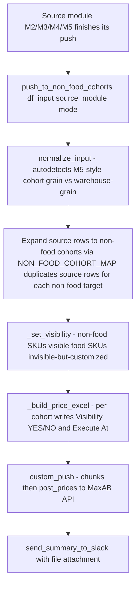

# Non-Food Cohorts Push Module

## Purpose

Mirrors price changes from any source pricing module (M2, M3, M4, M5) onto a parallel set of **non-food cohorts**, one per existing region. Cart rules are NOT mirrored. The module enforces a strict visibility rule: only non-food SKUs are visible on these cohorts; food SKUs are pushed as customized-but-invisible to prevent fallback to a parent cohort that would expose them.

Called from M2/M3/M4/M5 inside a `try/except` so a non-food failure never takes down the main run.

---

## Flow

---

## Cohort mapping

`NON_FOOD_COHORT_MAP` (list of tuples — supports multiple non-food cohorts per source):

| Source cohort | Non-food cohort | Region |
|---|---|---|
| 700 | 1255 | Cairo (secondary) |
| 700 | 1288 | Cairo |
| 701 | 1289 | Giza |
| 702 | 1290 | Alexandria |
| 703 | 1291 | Delta West |
| 704 | 1292 | Delta East |
| 1123 | 1293 | Upper Egypt - Menya |
| 1124 | 1294 | Upper Egypt - Assiut |
| 1125 | 1295 | Upper Egypt - Sohag |
| 1126 | 1296 | Upper Egypt - Beni Suef |

Non-food classification is by `categories.section_id IN (NON_FOOD_SECTION_IDS)` — a curated set of 20 section IDs (housekeeping, personal care, baby, beauty, etc.).

---

## Visibility logic

| SKU type | Pushed? | Visibility |
|---|---|---|
| Non-food (section in `NON_FOOD_SECTION_IDS`) | Yes | `YES` (with min-PU hide rule from `disable_pu_visibility` sheet) |
| Food (any other section) | Yes (customized invisible) | `NO` for all PUs |

Why we push food invisible: if we don't push, the cohort falls back to its parent, and the food SKU becomes orderable on a non-food cohort. By pushing it as customized-invisible, we override the inheritance and keep it hidden.

A safety check (`get_visible_food_skus_on_non_food_cohorts()`) detects food SKUs that are visible on non-food cohorts via inheritance and force-fixes them to invisible.

---

## Input shape autodetection

| Caller | Grain | Required columns | Detected by |
|---|---|---|---|
| M2 / M3 / M4 | warehouse + product | `warehouse_id`, `product_id`, `new_price` | `_is_m5_shape()` returns False |
| M5 | cohort + product + PU | `cohort_id`, `product_id`, `packing_unit_id`, `price` | `_is_m5_shape()` returns True |

`normalize_input(df_input, pus)` produces a unified internal dataframe at (cohort_id, product_id, packing_unit_id, price, basic_unit_count) grain.

---

## Custom push method

Unlike M2/M3/M4 which call `push_prices()` from `push_prices_handler`, this module has its own `custom_push()`. Why:

- It writes per-row `Visibility (YES/NO)` to enforce the food-invisible rule.
- It writes a per-row `Execute At` field (Cairo TZ) and supports per-cohort chunk size overrides (`CHUNK_SIZE_OVERRIDES`).
- It builds the Excel template with sheet name `Worksheet` (matches MaxAB's expected import format).
- Calls the low-level `post_prices()` API helper from `push_prices_handler` directly per chunk.

Default chunk size: 4000 rows per upload (matches `push_prices_handler`).

---

## Key functions

| Function | Description |
|---|---|
| `get_product_sections()` | Returns DataFrame of `(product_id, section_id, is_non_food)` from Snowflake (cached per process). |
| `get_visible_food_skus_on_non_food_cohorts()` | Detects food SKUs currently visible on non-food cohorts via inheritance. |
| `_normalize_columns(df)` | Lowercases column names. |
| `_is_m5_shape(df)` | Returns True if df has cohort+product+PU+`price` (M5 shape) vs warehouse+`new_price` (M2/M3/M4 shape). |
| `normalize_input(df_input, pus)` | Unifies any caller's df into (cohort_id, product_id, packing_unit_id, price, basic_unit_count). For M2/M3/M4: rolls warehouse to source cohort by NMV-weighted avg price, then expands to non-food targets via `NON_FOOD_COHORT_MAP`. |
| `_set_visibility(df_norm)` | Adds a `Visibility (YES/NO)` column per row using non-food classification. |
| `_build_price_excel(group, file_path)` | Writes the per-cohort Excel template (sheet name `Worksheet`, columns matching MaxAB's import expectation, includes `Execute At` in Cairo TZ). |
| `custom_push(df_norm, source_module, mode)` | Splits per cohort, applies chunk size overrides, calls `post_prices()` per chunk, returns a per-cohort result summary. |
| `push_to_non_food_cohorts(df_input, source_module, mode)` | Top-level entry point. Returns a dict `{cohort_id: {'rows', 'pushed', 'failed', 'reason'}}` plus a summary. |
| `send_summary_to_slack(result)` | Posts a formatted Slack summary with the per-cohort xlsx files attached. |

---

## Inputs / Outputs

### Inputs
| Source | Data |
|---|---|
| Caller (M2/M3/M4/M5) | DataFrame with `new_price` (warehouse grain) or `price` (cohort/PU grain) |
| Snowflake | `categories.section_id`, packing units, cohort visibility lookup |
| Google Sheets — `disable_pu_visibility` | List of (product_id, packing_unit_id) to force invisible |

### Outputs
| Output | Destination |
|---|---|
| Per-cohort Excel files | MaxAB API (price upload via `post_prices`) |
| Slack summary | `new-pricing-logic` channel (with files attached) |

---

## Configuration

| Parameter | Value | Description |
|---|---|---|
| `NON_FOOD_SECTION_IDS` | 20 IDs | Categories considered non-food |
| `NON_FOOD_COHORT_MAP` | 10 tuples | Source -> non-food cohort mapping (multi-target supported) |
| `SLACK_CHANNEL_NAME` | `new-pricing-logic` | Ops alert channel |
| `CHUNK_SIZE_DEFAULT` | 4000 | Rows per upload chunk |
| `CHUNK_SIZE_OVERRIDES` | `{}` | Per-cohort overrides (e.g. `{61: 2000}` if a cohort needs smaller chunks) |
| Excel sheet name | `Worksheet` | Matches MaxAB's expected import format |

---

## Error handling

- Each call from M2/M3/M4/M5 is wrapped in `try/except`. A non-food failure logs to Slack but does not fail the parent module's run.
- Empty input (no rows to push) returns `_empty_result(reason)` with a `'reason'` key explaining why (e.g. "no non-food sections after filter", "no rows match cohort map").
- Per-chunk upload failures are caught and counted in the per-cohort `'failed'` count; the rest of the chunks still attempt.
- Zero / negative prices are filtered out before upload (validation.500 protection).
- Duplicate (cohort, product, PU) rows are deduplicated (validation.500 protection).
- Empty / NaN `Product Name` is filled with `product_id` as a fallback (validation.500 protection).

---

## Dependencies

| Direction | Module |
|---|---|
| **Called by** | `module_2_initial_price_push`, `module_3_periodic_actions`, `module_4_hourly_updates`, `module_5_new_intros_invisible` |
| **Requires** | `setup_environment_2`, `db.query_snowflake`, `common_functions` (`send_text_slack`, `send_file_slack`), `push_prices_handler` (low-level `post_prices`), `queries_module` (disable_pu_visibility loader) |
| **External** | MaxAB API (price push), Snowflake (sections), Google Sheets (disable_pu_visibility), Slack |
