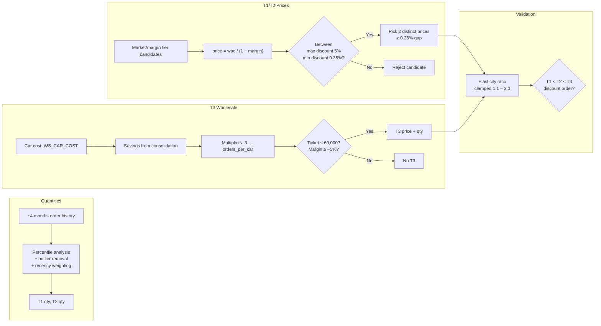

# QD Handler — Quantity Discount Manager

## Purpose

Manages the full lifecycle of multi-tier quantity discounts, called from Module 3. Deactivates all currently active QDs, then builds and uploads new tiered quantity discounts based on order history, market/margin pricing, and wholesale economics. Ensures retailers are incentivized to buy in larger quantities through progressive discount tiers.

---

## Pipeline Flow

```mermaid
flowchart TD
    START[Start: Called from Module 3] --> DEACT["Deactivate all active QDs"]
    DEACT --> MERGE["Merge top-selling PU data"]
    MERGE --> EFF["Calculate effective_price\nper warehouse × product"]
    EFF --> TICKETS["Warehouse ticket stats\nfrom order history"]

    TICKETS --> TQTY[Calculate tier quantities]
    TQTY --> TQTY_DETAIL["T1/T2 from ~4 months\norder history:\n• Percentiles\n• Outlier removal\n• Recency weighting"]

    TQTY_DETAIL --> T12_PRICE[Calculate T1/T2 prices]
    T12_PRICE --> T12_DETAIL["From market/margin tier candidates\nprice = wac / (1 − margin)\nBetween max discount 5%\nand min discount 0.35%\nPick 2 distinct prices\nwith ≥ 0.25% gap"]

    T12_DETAIL --> T3[Calculate T3 wholesale]
    T3 --> T3_DETAIL["Savings from consolidating\norders vs car cost\nMultipliers: 3 … orders_per_car\nWS_MAX_TICKET_SIZE = 60,000\nWS_MIN_MARGIN = −5%"]

    T3_DETAIL --> VALIDATE[Validation]
    VALIDATE --> V1{"Strict ordering:\nT1 < T2 < T3 discount?"}
    V1 -- No --> CLEAR["Clear invalid tiers"]
    V1 -- Yes --> V2{"≥ 2 active tiers?"}
    V2 -- No --> CLEAR
    V2 -- Yes --> RANK["Rank by stocks × wac_p"]
    CLEAR --> V2

    RANK --> CAP["Cap: 400 tier entries\nper warehouse"]
    CAP --> UPLOAD["Excel upload to MaxAB API"]
    UPLOAD --> CART["Cart rules alignment"]
    CART --> DONE[Done]
```

---

## Tier Calculation Detail

### Elasticity Ratio
- Clamped between **1.1** and **3.0**
- Ensures quantity jumps between tiers are proportional to discount increases

---

## Key Functions

| Function | Description |
|----------|-------------|
| QD deactivation | Deactivates all currently active quantity discounts |
| Top-selling PU merger | Identifies highest-selling packing units for QD creation |
| Effective price calculator | Computes effective price per warehouse × product |
| Tier quantity calculator | Derives T1/T2 quantities from ~4 months order history (percentiles, outliers, recency) |
| T1/T2 price calculator | Selects 2 distinct discount prices from market/margin candidates within 0.35%–5% band |
| T3 wholesale calculator | Computes wholesale tier from delivery consolidation savings vs car cost |
| Tier validator | Enforces strict T1 < T2 < T3 ordering; clears invalid tiers; requires ≥ 2 active tiers |
| Ranking + cap | Ranks by `stocks × wac_p`; caps at 400 entries per warehouse |
| Upload builder | Splits into Group 1 (T1+WS, max 200 lines) and Group 2 (T2 + overflow) |

---

## Inputs / Outputs

### Inputs
| Source | Data |
|--------|------|
| Module 3 | Trigger signal with SKU list flagged for QD |
| Snowflake | Order history (~4 months), active QDs, market/margin tiers |
| Snowflake | Warehouse ticket stats, stock levels, WAC |

### Outputs
| Output | Destination |
|--------|-------------|
| Deactivation commands | MaxAB API |
| New QD tiers (Excel) | MaxAB API — Group 1: T1+WS (max 200 lines), Group 2: T2 + overflow |
| Cart rule alignment | MaxAB API |

---

## Configuration

| Parameter | Value | Description |
|-----------|-------|-------------|
| T1 max discount | 4% | Maximum discount for tier 1 |
| T2 max discount | 5% | Maximum discount for tier 2 |
| T3 max discount | 6% | Maximum discount for tier 3 |
| Min discount | 0.35% | Minimum meaningful discount |
| Min gap between tiers | 0.25% | Minimum discount gap between T1 and T2 |
| Elasticity ratio range | 1.1 – 3.0 | Clamped ratio between tier quantity jumps |
| Duration | 14 hours | QD active period (start = now + 10 min) |
| `WS_CAR_COST` | Configurable | Delivery car cost for wholesale calculation |
| `WS_MAX_TICKET_SIZE` | 60,000 | Maximum wholesale ticket value |
| `WS_MIN_MARGIN` | −5% | Floor margin for wholesale tier |
| Max entries per warehouse | 400 | Cap on tier entries per warehouse |
| Group 1 max lines | 200 | Upload batch size for T1+WS |

---

## Dependencies

| Direction | Module |
|-----------|--------|
| **Called by** | `module_3_periodic_actions` |
| **Requires** | `queries_module` (order history, active QDs), `market_data_module` (tier candidates), `common_functions` (API upload) |
| **External** | MaxAB API (QD creation/deactivation) |
