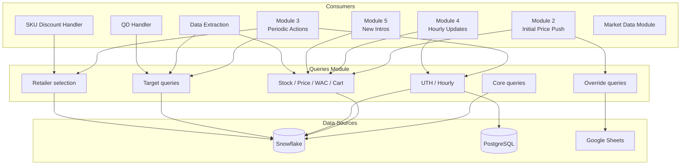

# Queries Module — Shared Data Access Layer

## Purpose

Centralized data access layer providing live queries to Snowflake, PostgreSQL, and Google Sheets for all pricing modules. Every module depends on this layer for real-time stock, price, UTH, and configuration data. Contains no business logic — purely data retrieval and light transformation.

---

## Architecture

---

## Function Groups

### 1. Core

| Function | Description |
|----------|-------------|
| `query_snowflake` | Executes arbitrary SQL against Snowflake and returns DataFrame |
| `get_snowflake_timezone` | Returns current Snowflake session timezone |

### 2. Stocks / Prices / WAC / Cart

| Function | Description |
|----------|-------------|
| `get_current_stocks` | Current stock levels with parent → child warehouse fallback (236↔343, 1↔467, 962↔343) |
| `get_current_prices` | DBDP live slot prices + cohort prices |
| `get_current_wac` | WAC from `finance.all_cogs` |
| `get_current_cart_rules` | `MAX_PER_SALES_ORDER` with fallback cohort; groupby min |
| `get_packing_units` | Preferred packing unit based on 60-day sales history |
| `get_commercial_min_prices` | Fresh commercial minimum price constraints from `finance.minimum_prices` (consumed by Module 3 and Module 4 on every run) |

### 3. UTH / Hourly

| Function | Description |
|----------|-------------|
| `get_uth_performance` | Today's cumulative performance excluding current hour |
| `get_hourly_distribution` | ~120-day average hourly distribution (% per hour) |
| `get_hourly_contribution_by_hour` | Normalized hourly contribution (hours 0–23) |
| `get_stock_snapshots_today` | Intraday stock snapshots |
| `get_last_hour_performance` | Last hour's performance from PostgreSQL DWH |
| `get_yesterday_closing_stock` | End-of-day stock from previous day |

### 4. Overrides

| Function | Description |
|----------|-------------|
| `get_fixed_prices` | Fixed prices from Google Sheet "Fixed Price" tab |
| `get_fixed_cart_rules` | Fixed cart rules from Google Sheet "Fixed Price" tab |

### 5. Targets

| Function | Description |
|----------|-------------|
| `get_quarterly_contribution` | Per-category quarterly contribution [0.9, 1.1] from 3-year weighted history |
| `get_target_turnover_qty` | Turnover quantity targets for high-DOH SKUs |
| `get_percentile_data` | Order-line percentiles + layers for cart rule calibration |
| `get_active_qd_now` | Currently active quantity discounts |

### 6. Retailer Selection

| Function | Description |
|----------|-------------|
| `get_churned_dropped_retailers` | Retailers who were buying but stopped |
| `get_category_not_product_retailers` | Retailers buying category but not specific product |
| `get_out_of_cycle_retailers` | Infrequent buyers |
| `get_view_no_orders_retailers` | Retailers who viewed but didn't purchase |
| `get_excluded_retailers` | Retailers excluded from targeting (failed orders, inactive, wholesale) |
| `get_retailers_with_quantity_discount` | Retailers already on a QD for conflict avoidance |
| `get_retailer_main_warehouse` | Maps retailers to their primary warehouse |

---

## Inputs / Outputs

### Inputs (Data Sources)
| Source | Connection | Used For |
|--------|------------|----------|
| **Snowflake** | Primary | Stocks, prices, WAC, UTH, targets, order history, retailer data |
| **PostgreSQL** | DWH | Last-hour performance, PO/lead time data |
| **Google Sheets** | "Fixed Price" sheet | Fixed price and cart rule overrides |

### Outputs
All functions return **pandas DataFrames** consumed by calling modules.

---

## Hard-Coded Values

### Parent Warehouse Mapping
| Parent | Child | Relationship |
|--------|-------|-------------|
| 236 | 343 | Fallback pair |
| 1 | 467 | Fallback pair |
| 962 | 343 | Fallback pair |

### Excluded Warehouses
| Warehouse IDs | Reason |
|---------------|--------|
| 6, 9, 10 | Excluded from all pricing operations |

### Channels
| Channel | Status |
|---------|--------|
| Telesales | Included |
| Retailer | Included |

### Excluded Order Statuses
| Status ID | Description |
|-----------|-------------|
| 7 | Excluded |
| 12 | Excluded |

---

## Configuration

| Parameter | Value | Description |
|-----------|-------|-------------|
| Snowflake connection | Via `setup_environment_2` | Connection credentials and session config |
| PostgreSQL connection | Via `setup_environment_2` | DWH connection for hourly data |
| Google Sheets ID | Configured in env | "Fixed Price" spreadsheet |
| Stock fallback | Parent → child warehouse | Automatic stock aggregation for paired warehouses |
| Cart rule aggregation | `groupby min` | When multiple cart rules exist, take the minimum |
| Packing unit lookback | 60 days | Sales history for preferred PU selection |
| Hourly distribution lookback | ~120 days | Historical average for UTH contribution |
| Quarterly contribution range | [0.9, 1.1] | Clamped quarterly contribution factor |
| Quarterly contribution history | 3 years | Weighted historical lookback |

---

## Dependencies

| Direction | Module |
|-----------|--------|
| **Required by** | Every module in the pricing system |
| **Requires** | `setup_environment_2` (database connections, environment config) |
| **External** | Snowflake, PostgreSQL, Google Sheets API |
