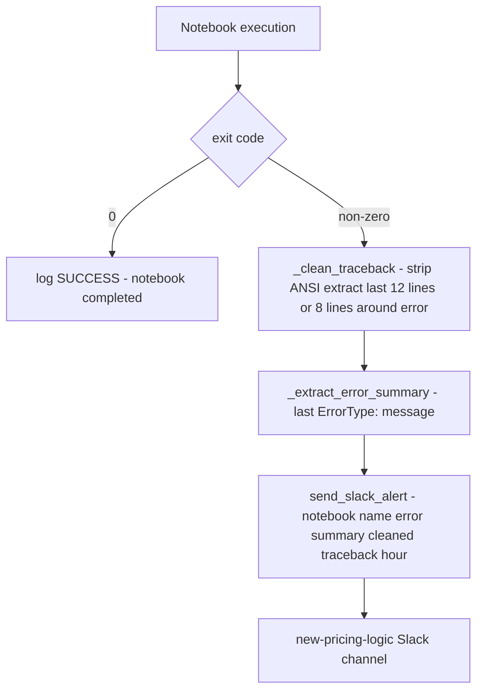

# Scheduler — Pricing Logic Orchestrator

## Purpose

Single-process scheduler that triggers each pricing notebook at its configured Cairo time via `jupyter nbconvert --execute`. Captures stdout/stderr per notebook, posts per-failure Slack alerts (with cleaned traceback), and emits an end-of-hour summary.

Lives at `Mustafa/scheduler.ipynb`. Runs as a long-lived process on AWS.

---

## Schedule

| Cairo hour | Notebooks |
|---|---|
| 01:00 | `module_4` |
| 02:00 | `module_4` |
| 03:00 | `module_4` |
| 08:00 | `data_extraction`, `module_2` |
| 09:00 | `module_4`, `treasure_hunt` |
| 10:00 | `module_4`, `module_5` |
| 11:00 | `module_4`, `bs_mapping` |
| 12:00 | `module_3` |
| 13:00 | `module_4`, `effective_tiers_export` |
| 14:00 | `module_4` |
| 15:00 | `module_4`, `Savvy_update` |
| 16:00 | `module_5`, `module_4` |
| 17:00 | `module_3` |
| 18:00 | `module_4` |
| 19:00 | `module_4` |
| 20:00 | `module_4` |
| 21:00 | `module_4`, `module_5` |
| 22:00 | `module_4` |
| 23:00 | `module_3` |

Schedule lives in the `SCHEDULE` dict in the notebook. Add or remove notebooks by editing it directly.

---

## Notebook key map (`NOTEBOOKS` dict)

| Key | Path |
|---|---|
| `data_extraction` | `data_extraction.ipynb` |
| `module_2` | `modules/module_2_initial_price_push.ipynb` |
| `module_3` | `modules/module_3_periodic_actions.ipynb` |
| `module_4` | `modules/module_4_hourly_updates.ipynb` |
| `module_5` | `modules/module_5_new_intros_invisible.ipynb` |
| `treasure_hunt` | `treasure_hunt_scheduler.ipynb` |
| `effective_tiers_export` | `modules/effective_tiers_export.ipynb` |
| `bs_mapping` | `Mapping/bs_mapping_pipeline.ipynb` |

---

## Run modes

| Function | What it does |
|---|---|
| `run_continuous()` | Long-lived loop: every minute checks the current Cairo hour and runs anything in `SCHEDULE[hour]` that hasn't already run that hour. |
| `run_once()` | Runs everything scheduled for the current hour exactly once and exits. Useful for one-shot triggers. |
| `run_test()` | Logs what WOULD run for the current hour but does nothing. Use to dry-run a schedule change. |
| `run_specific_hour(hour, test_mode=False)` | Force-run a specific hour's tasks. Useful for catch-up after an outage. |

---

## Per-notebook execution

`run_notebook(notebook_name, test_mode, hour)`:

1. Looks up the path in `NOTEBOOKS`.
2. Runs `jupyter nbconvert --execute --to notebook --output <name>_executed.ipynb <path>` via `subprocess`.
3. Captures stdout + stderr.
4. On non-zero exit: cleans the traceback (strips ANSI), extracts the final error type/message, posts a Slack alert.
5. Returns success bool.

---

## Slack alerting

| Function | Purpose |
|---|---|
| `_clean_traceback(text)` | Strips ANSI color codes, extracts most useful part of Jupyter traceback. Caps at 1500 chars. |
| `_extract_error_summary(text)` | Returns just the final `ErrorType: message` line for the alert headline. |
| `send_slack_alert(notebook_name, error_message, hour)` | Per-failure Slack post with notebook name, error summary, and cleaned traceback. |
| `send_slack_summary(hour, results)` | End-of-hour summary post: success/failure counts per notebook. |

Slack channel: `new-pricing-logic`.

---

## Logging

- Plain-text log at `Mustafa/scheduler.log`.
- Format: `[YYYY-MM-DD HH:MM:SS] message`.
- Every action logs (start, success, failure, scheduling skip).
- Slack channel mirrors errors and end-of-hour summaries.

---

## Error model

- A single notebook failure does NOT block others from running.
- The scheduler does NOT retry within the same hour; the failure logs to Slack and the hour moves on.
- `module_4` runs almost every hour, so most issues self-heal on the next slot. Critical failures (`module_2`, `data_extraction`, `module_3`) need manual review.

---

## Running on AWS

The scheduler runs as a `nohup python -m jupyter nbconvert --execute scheduler.ipynb` (or similar) inside the SageMaker notebook environment. The process owns the kernel, so any uncaught exception in the scheduler itself takes down the whole loop. Wrap risky changes in try/except.

---

## Common operational tasks

| Task | Action |
|---|---|
| Add a new notebook | Add to `NOTEBOOKS` dict + add the key to `SCHEDULE[hour]` |
| Change a notebook's slot | Move the key between hours in `SCHEDULE` |
| Pause a notebook for the day | Comment out its key in `SCHEDULE`; restart the scheduler |
| Catch up after outage | Call `run_specific_hour(hour)` for each missed hour |
| Test a change before deploy | Edit `SCHEDULE`, run `run_test()` to verify expected execution |

---

## Dependencies

| Direction | Module |
|---|---|
| **Triggers** | All scheduled notebooks via subprocess |
| **Requires** | `jupyter` CLI on PATH, `setup_environment_2` (for environment configuration), `common_functions` (Slack helpers) |
| **External** | Slack (`new-pricing-logic` channel), local filesystem (log file, `_executed.ipynb` artifacts) |
