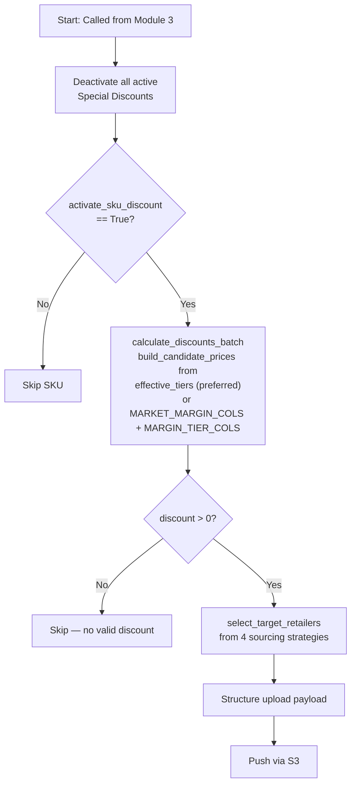
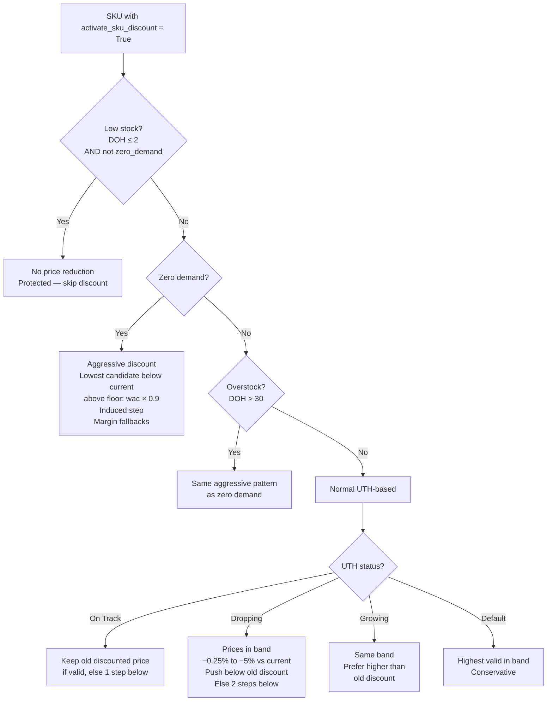
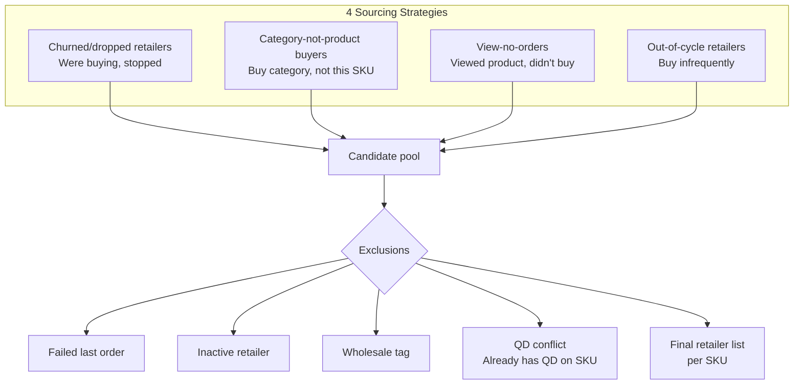

# SKU Discount Handler — Special Discounts Manager

## Purpose

Manages per-SKU "Special Discounts" targeted at specific retailers, called from Module 3. Handles the full lifecycle: deactivates existing discounts, calculates new discount prices based on inventory status and UTH performance, selects target retailers from four sourcing strategies, and pushes via S3 upload.

---

## Pipeline Flow

---

## Discount Logic Branches

### Discount Bands

| Scenario | Strategy | Floor |
|----------|----------|-------|
| Zero demand | Lowest candidate below current price | `wac × 0.9` |
| Overstock (DOH > 30) | Same as zero demand | `wac × 0.9` |
| On Track | Maintain old discount or 1 step below | Min discount 0.25% |
| Dropping | Band: −0.25% to −5% vs current; push below old discount or 2 steps below | Min discount 0.25% |
| Growing | Band: −0.25% to −5% vs current; prefer higher than old discount | Min discount 0.25% |
| Default | Highest valid price in band (conservative) | Min discount 0.25% |

---

## Retailer Targeting

---

## Key Functions

| Function | Description |
|----------|-------------|
| Deactivation | Deactivates all currently active Special Discounts |
| `build_candidate_prices` | Builds the candidate price list for a SKU — prefers `effective_tiers` (passed from Module 3), falls back to `MARKET_MARGIN_COLS` + `MARGIN_TIER_COLS` individual columns |
| `calculate_discounts_batch` | Batch discount price calculation across all eligible SKUs using candidate prices |
| Discount logic router | Routes to low-stock / zero-demand / overstock / UTH-based logic |
| `select_target_retailers` | Merges 4 retailer sources, applies exclusions, removes QD conflicts |
| Upload structurer | Formats payload for S3 upload with chunking constraints |
| S3 pusher | Uploads discount files to S3 for downstream processing |

---

## Inputs / Outputs

### Inputs
| Source | Data |
|--------|------|
| Module 3 | SKU list with `activate_sku_discount = True` + UTH status + `effective_tiers` |
| Snowflake | Current prices, WAC, DOH, old discount prices |
| Snowflake | Retailer pools (churned, category buyers, viewers, out-of-cycle) |
| Snowflake | Exclusion lists (failed orders, inactive, wholesale, active QDs) |

### Outputs
| Output | Destination |
|--------|-------------|
| Deactivation commands | MaxAB API |
| Special Discount files | S3 upload |

---

## Configuration

| Parameter | Value | Description |
|-----------|-------|-------------|
| `DEFAULT_DISCOUNT_DURATION_HOURS` | 14 | Discount active period |
| `MAX_DISCOUNT_PERCENT` | 5% | Maximum discount off list price |
| `MIN_DISCOUNT_PERCENT` | 0.25% | Minimum meaningful discount |
| `DOH_OVERSTOCK_THRESHOLD` | 30 | DOH above which SKU is overstocked |
| `LOW_STOCK_DOH_THRESHOLD` | 2 | DOH below which SKU is protected |
| `MAX_RETAILERS_PER_CHUNK` | 100 | Max retailers per upload chunk |
| `MAX_ROWS_PER_FILE` | 1,000 | Max rows per S3 file |
| Aggressive floor | `wac × 0.9` | Floor for zero-demand / overstock discounts |

---

## Dependencies

| Direction | Module |
|-----------|--------|
| **Called by** | `module_3_periodic_actions` |
| **Requires** | `queries_module` (retailer pools, exclusions, active QDs), `market_data_module` (tier candidates), `common_functions` (S3 upload) |
| **Coordinates with** | `qd_handler` (removes QD-conflicting retailers) |
| **External** | S3 (discount file upload), MaxAB API (deactivation) |
