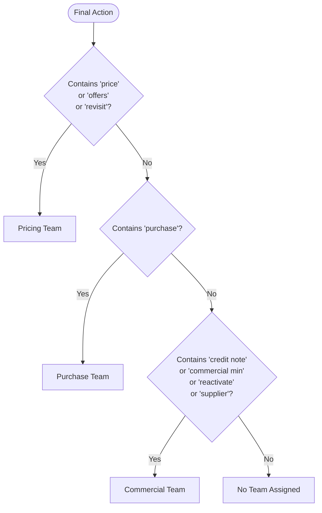

# Pricing Status Decision Flowchart

## Main Decision Flow (`determine_action`)

```mermaid
flowchart TD
    START([Start]) --> OOS{Stock = OOS?}
    
    OOS -->|Yes| PURCHASE[Purchase]
    OOS -->|No| OOS_YEST{low rr + OOS yesterday<br/>+ today_rr > 0?}
    
    OOS_YEST -->|Yes| NO_ACTION1[No action]
    OOS_YEST -->|No| REVISIT_CHECK{High/Very High rr<br/>+ has blended_price<br/>+ offers_perc > 0?}
    
    REVISIT_CHECK -->|Yes| MARKET_DATA{Has market data?}
    REVISIT_CHECK -->|No| STOCK_LEVEL{Stock Level?}
    
    MARKET_DATA -->|Yes| BLENDED_MARKET{blended_price < <br/>99% min_market?}
    MARKET_DATA -->|No| BLENDED_MARGIN{blended_margin < <br/>target - 15%?}
    
    BLENDED_MARKET -->|Yes| REVISIT[Revisit the offer]
    BLENDED_MARKET -->|No| STOCK_LEVEL
    
    BLENDED_MARGIN -->|Yes| REVISIT
    BLENDED_MARGIN -->|No| STOCK_LEVEL
    
    STOCK_LEVEL -->|Good stocks| GOOD_STOCKS
    STOCK_LEVEL -->|low stock| LOW_STOCK
    STOCK_LEVEL -->|Over Stocked| OVER_STOCKED
    
    subgraph GOOD_STOCKS[Good Stocks Flow]
        GS_START([Good Stocks]) --> GS_LOW_PRICE{Low Price/below target<br/>+ low rr?}
        GS_LOW_PRICE -->|Yes| GS_OFFERS_LOW{offers < 10%?}
        GS_OFFERS_LOW -->|Yes| GS_OFFERS_CN[Offers & Credit Note]
        GS_OFFERS_LOW -->|No| GS_CN[Credit Note]
        
        GS_LOW_PRICE -->|No| GS_LOW_PRICE2{Low Price/below target<br/>+ NOT low rr?}
        GS_LOW_PRICE2 -->|Yes| GS_INC[Increase price]
        
        GS_LOW_PRICE2 -->|No| GS_HIGH_PRICE{High price/room to reduce<br/>+ low rr?}
        GS_HIGH_PRICE -->|Yes| GS_COMM_MIN{commercial_min blocking?}
        GS_COMM_MIN -->|No| GS_REDUCE[Reduce price]
        GS_COMM_MIN -->|Yes| GS_REMOVE_CM[Remove commercial min]
        
        GS_HIGH_PRICE -->|No| GS_ABOVE{above target + low rr?}
        GS_ABOVE -->|Yes| GS_ABOVE_OFFERS{offers < 10%?}
        GS_ABOVE_OFFERS -->|Yes| GS_OFFERS[Offers]
        GS_ABOVE_OFFERS -->|No| GS_ABOVE_COMM{commercial_min blocking?}
        GS_ABOVE_COMM -->|No| GS_REDUCE2[Reduce price]
        GS_ABOVE_COMM -->|Yes| GS_REMOVE_CM2[Remove commercial min]
        
        GS_ABOVE -->|No| GS_NORMAL{Normal rr?}
        GS_NORMAL -->|Yes| GS_NO_ACT[No action]
        
        GS_NORMAL -->|No| GS_VERYHIGH{Very High rr<br/>+ margin < target?}
        GS_VERYHIGH -->|Yes| GS_INC2[Increase price]
        
        GS_VERYHIGH -->|No| GS_HIGH_GOOD{High/Very High rr<br/>+ margin >= target?}
        GS_HIGH_GOOD -->|Yes| GS_NO_ACT2[No action]
        
        GS_HIGH_GOOD -->|No| GS_HIGH_LOW{High rr + margin < target?}
        GS_HIGH_LOW -->|Yes| GS_INC_BIT[Increase price a bit]
    end
    
    subgraph LOW_STOCK[Low Stock Flow]
        LS_START([Low Stock]) --> LS_CN{Credit note/below target<br/>+ low rr?}
        LS_CN -->|Yes| LS_P_CN[Purchase & Credit Note]
        
        LS_CN -->|No| LS_LOW_P{Low Price + low rr?}
        LS_LOW_P -->|Yes| LS_OFF{offers < 10%?}
        LS_OFF -->|Yes| LS_P_O_CN[Purchase & Offers & Credit Note]
        LS_OFF -->|No| LS_P_CN2[Purchase & Credit Note]
        
        LS_LOW_P -->|No| LS_HIGH{High price/room to reduce<br/>+ low rr?}
        LS_HIGH -->|Yes| LS_COMM{commercial_min blocking?}
        LS_COMM -->|No| LS_P_RED[Purchase & Reduce price]
        LS_COMM -->|Yes| LS_P_REM[Purchase & Remove commercial min]
        
        LS_HIGH -->|No| LS_ABOVE{above target + low rr?}
        LS_ABOVE -->|Yes| LS_AB_OFF{offers < 10%?}
        LS_AB_OFF -->|Yes| LS_P_OFF[Purchase & Offers]
        LS_AB_OFF -->|No| LS_AB_COMM{commercial_min blocking?}
        LS_AB_COMM -->|No| LS_P_RED2[Purchase & Reduce price]
        LS_AB_COMM -->|Yes| LS_P_REM2[Purchase & Remove commercial min]
        
        LS_ABOVE -->|No| LS_NORM{High/Normal rr?}
        LS_NORM -->|Yes| LS_PURCH[Purchase]
        
        LS_NORM -->|No| LS_VH{Very High rr?}
        LS_VH -->|Yes| LS_P_INC[Purchase & Increase price]
    end
    
    subgraph OVER_STOCKED[Over Stocked Flow]
        OS_START([Over Stocked]) --> OS_LOW{Low Price/below target/Credit note<br/>+ low rr?}
        OS_LOW -->|Yes| OS_CN[Credit Note]
        
        OS_LOW -->|No| OS_HIGH{High price/room to reduce<br/>+ low rr?}
        OS_HIGH -->|Yes| OS_CURR{cu_rr > 0?}
        OS_CURR -->|Yes| OS_COMM{commercial_min blocking?}
        OS_COMM -->|No| OS_RED[Reduce price]
        OS_COMM -->|Yes| OS_REM[Remove commercial min]
        
        OS_CURR -->|No| OS_TODAY{today_rr == 0?}
        OS_TODAY -->|Yes| OS_ACT{activation = False?}
        OS_ACT -->|Yes| OS_REACT[Reactivate]
        OS_ACT -->|No| OS_COMM2{commercial_min blocking?}
        OS_COMM2 -->|No| OS_RED2[Reduce price]
        OS_COMM2 -->|Yes| OS_REM2[Remove commercial min]
        
        OS_TODAY -->|No| OS_NO_ACT[No action - recovering]
        
        OS_HIGH -->|No| OS_ABOVE{above target + low rr?}
        OS_ABOVE -->|Yes| OS_AB_CURR{cu_rr > 0?}
        OS_AB_CURR -->|Yes| OS_AB_OFF{offers < 10%?}
        OS_AB_OFF -->|Yes| OS_OFFERS[Offers]
        OS_AB_OFF -->|No| OS_AB_COMM{commercial_min blocking?}
        OS_AB_COMM -->|No| OS_AB_RED[Reduce price]
        OS_AB_COMM -->|Yes| OS_AB_REM[Remove commercial min]
        
        OS_AB_CURR -->|No| OS_AB_TODAY{today_rr == 0?}
        OS_AB_TODAY -->|Yes| OS_AB_ACT{activation = False?}
        OS_AB_ACT -->|Yes| OS_AB_REACT[Reactivate]
        OS_AB_ACT -->|No| OS_AB_OFF2{offers < 10%?}
        OS_AB_OFF2 -->|Yes| OS_OFFERS2[Offers]
        OS_AB_OFF2 -->|No| OS_AB_COMM2{commercial_min blocking?}
        OS_AB_COMM2 -->|No| OS_AB_RED2[Reduce price]
        OS_AB_COMM2 -->|Yes| OS_AB_REM2[Remove commercial min]
        
        OS_AB_TODAY -->|No| OS_NO_ACT2[No action - recovering]
        
        OS_ABOVE -->|No| OS_HIGH_RR{High/Normal/Very High rr<br/>+ not low rr?}
        OS_HIGH_RR -->|Yes| OS_DOH{DOH < 30?}
        OS_DOH -->|Yes| OS_NO_ACT3[No Action]
        OS_DOH -->|No| OS_PRICE_HIGH{High price/above target?}
        OS_PRICE_HIGH -->|Yes| OS_RED_FINAL[Reduce Price]
        OS_PRICE_HIGH -->|No| OS_CN_FINAL[Credit Note]
    end
```



---

## Stock Issue Ownership Flow (OOS & Low Stock Only)

```mermaid
flowchart TD
    START([OOS or Low Stock Product]) --> ORDERED{Ordered in last 2 days?}
    
    ORDERED -->|No / Never| PURCH_NEVER["Purchase team<br/>(last order: DATE/Never)"]
    ORDERED -->|Yes| QTY_CHECK{ordered_qty < min_required?<br/>min = 3 * min(high_rr, cu_rr)}
    
    QTY_CHECK -->|Yes - Low qty| PURCH_LOW["Purchase team<br/>(ordered qty X is low, need Y)"]
    QTY_CHECK -->|No - Enough qty| GAP_CHECK{In top 60% NMV gap?}
    
    GAP_CHECK -->|Yes| REJECT_CHECK{no_last_15 > 0?<br/>Supplier rejections?}
    GAP_CHECK -->|No| DEFAULT[No action]
    
    REJECT_CHECK -->|Yes| COMMERCIAL["Commercial team<br/>(N rejections) - negotiate supplier"]
    REJECT_CHECK -->|No| DEFAULT
```

---

## Team Assignment Flow



---

## Key Variables Reference

| Variable | Description |
|----------|-------------|
| `stock_comment` | OOS, low stock, Good stocks, Over Stocked |
| `price_comment` | Low Price, below target, Credit note, High price, room to reduce, above target |
| `rr_comment` | low rr, Normal rr, High rr, Very High rr |
| `offers_perc` | Percentage of orders with discounts |
| `commercial_min` | Commercial minimum price constraint |
| `bm` | Current blended margin |
| `target` | Target margin |
| `cu_rr` | Current running rate (average) |
| `today_rr` | Today's running rate |
| `activation` | Product activation status |
| `oos_yesterday` | Was product OOS yesterday (1/0) |
| `blended_price` | Net price after all discounts |
| `blended_margin` | Margin using blended price |
| `combined_min_market` | Minimum market price from all sources |

---

## How to View This Flowchart

1. **VS Code**: Install "Markdown Preview Mermaid Support" extension
2. **GitHub**: Paste in any .md file - GitHub renders Mermaid natively
3. **Online**: Use [Mermaid Live Editor](https://mermaid.live/)
4. **Notion**: Paste as code block with "mermaid" language

