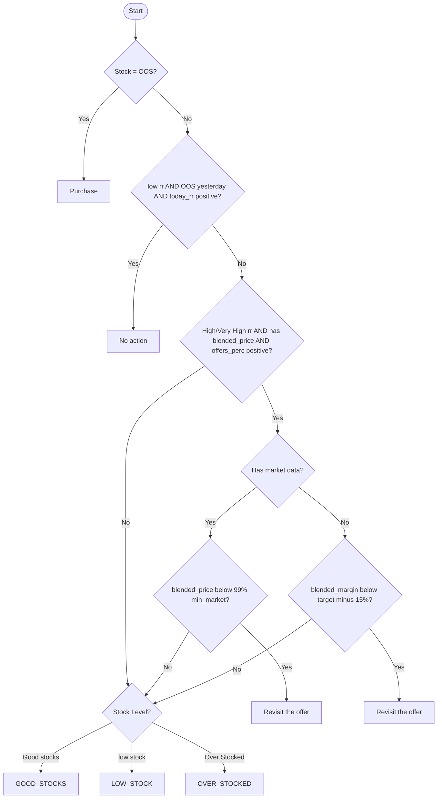
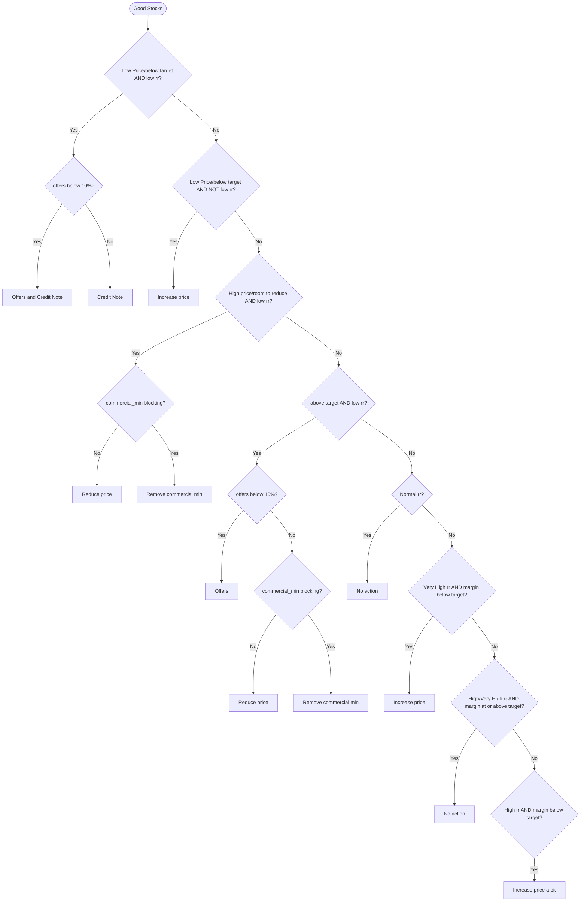
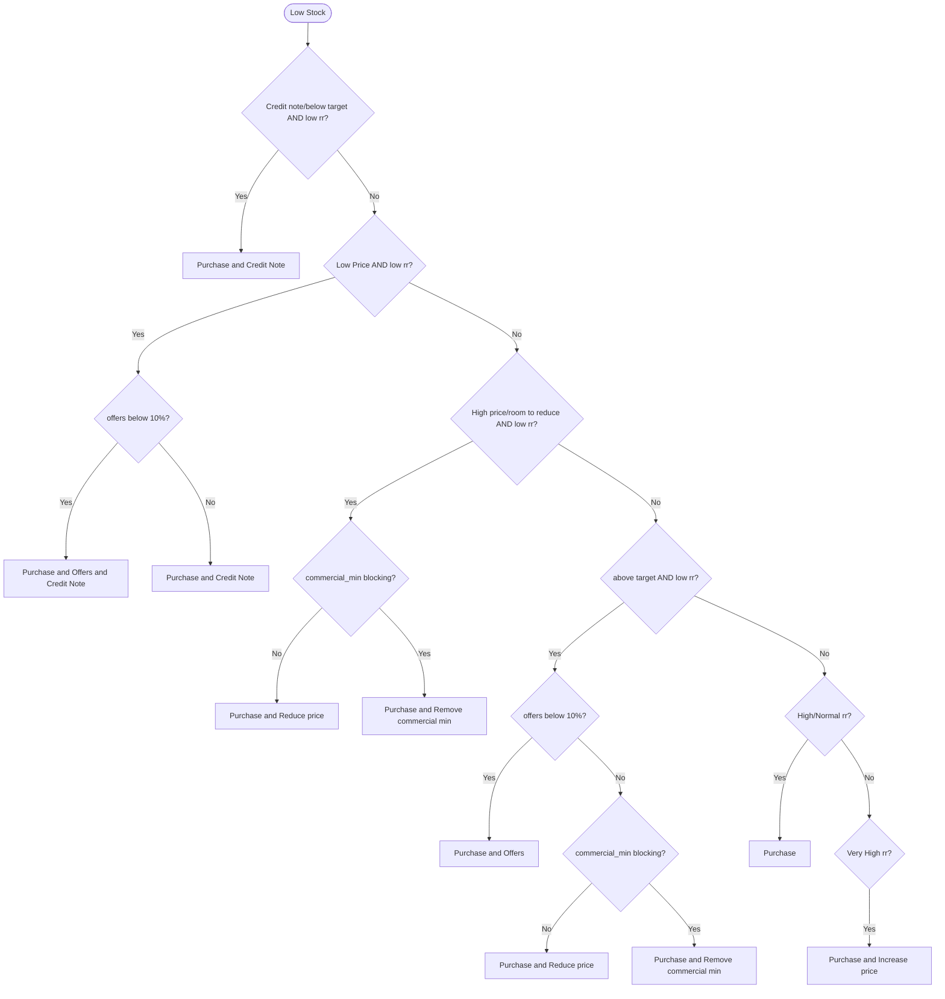
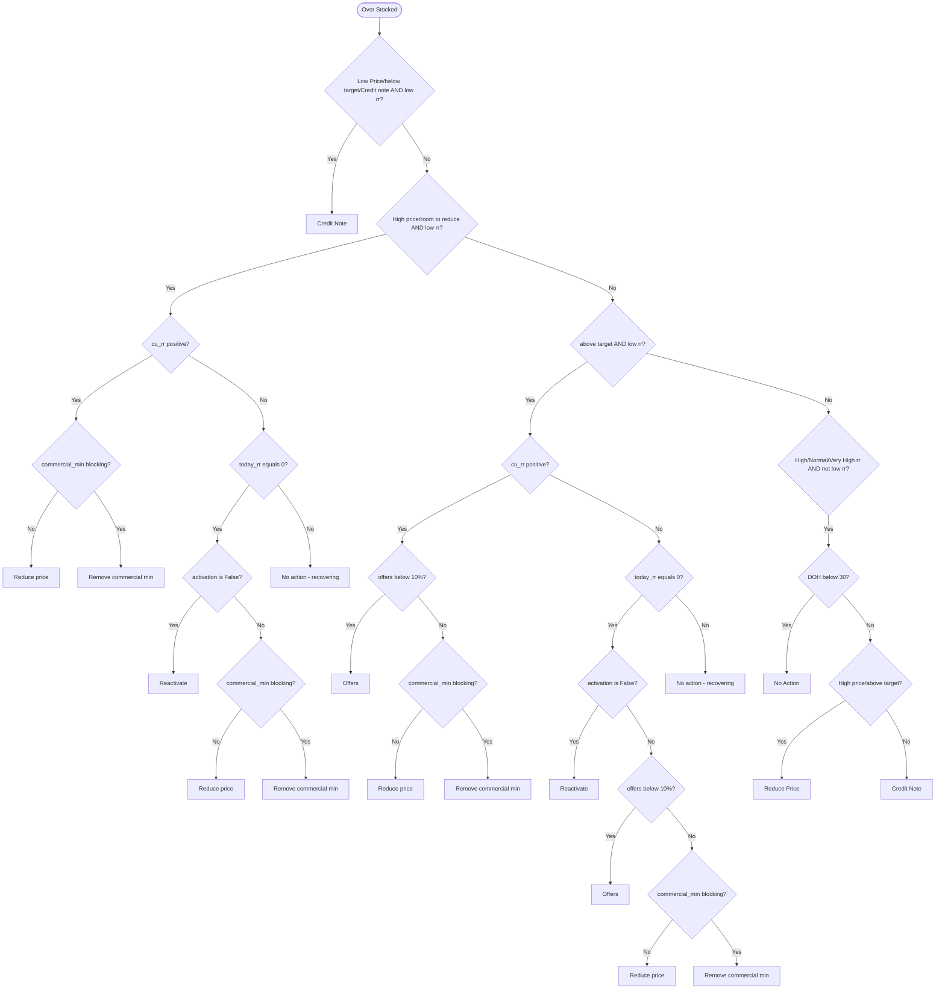
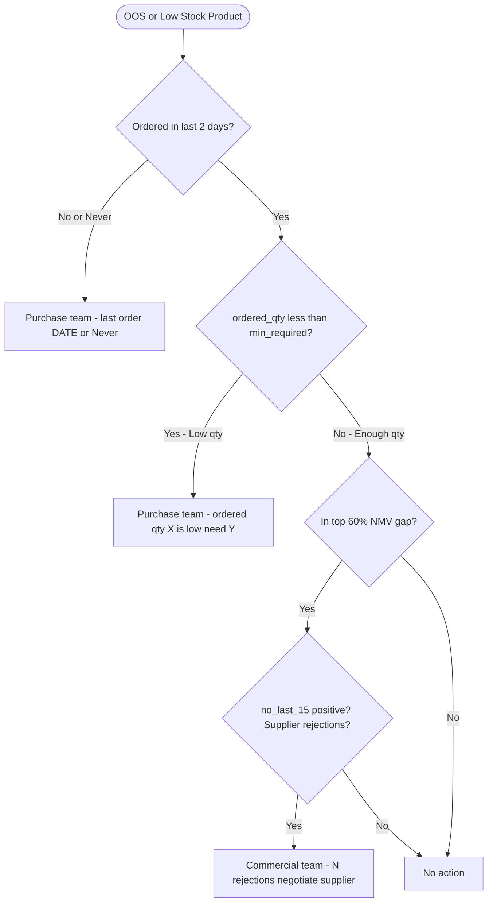
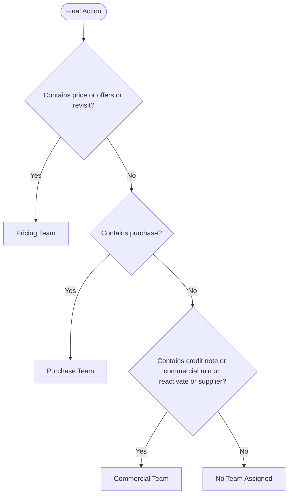

# Pricing Status Decision Flowchart

## Main Decision Flow

---

## Good Stocks Flow

---

## Low Stock Flow

---

## Over Stocked Flow

---

## Stock Issue Ownership Flow - OOS and Low Stock Only

---

## Team Assignment Flow

---

## Key Variables Reference

| Variable | Description |
|----------|-------------|
| stock_comment | OOS, low stock, Good stocks, Over Stocked |
| price_comment | Low Price, below target, Credit note, High price, room to reduce, above target |
| rr_comment | low rr, Normal rr, High rr, Very High rr |
| offers_perc | Percentage of orders with discounts |
| commercial_min | Commercial minimum price constraint |
| bm | Current blended margin |
| target | Target margin |
| cu_rr | Current running rate average |
| today_rr | Todays running rate |
| activation | Product activation status |
| oos_yesterday | Was product OOS yesterday 1 or 0 |
| blended_price | Net price after all discounts |
| blended_margin | Margin using blended price |
| combined_min_market | Minimum market price from all sources |

---

## How to View This Flowchart

1. **VS Code**: Install Markdown Preview Mermaid Support extension
2. **GitHub**: Paste in any .md file - GitHub renders Mermaid natively
3. **Online**: Use Mermaid Live Editor at mermaid.live
4. **Notion**: Paste as code block with mermaid language
